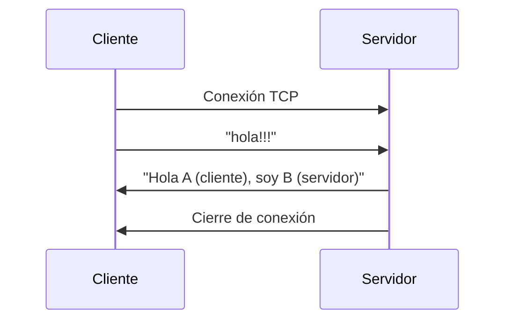

# TP1 - Sistemas Distribuidos  
## Hit 1 - Comunicación Cliente-Servidor con Sockets TCP

---

# Descripción

En este primer hit se implementa un sistema básico de **comunicación cliente-servidor utilizando sockets TCP en Python**.

El objetivo es comprender cómo dos procesos pueden comunicarse a través de la red utilizando el modelo **cliente-servidor**.

El funcionamiento general del sistema es el siguiente:

1. El servidor se inicia y queda escuchando conexiones entrantes.
2. El cliente se conecta al servidor utilizando una dirección IP y un puerto.
3. El cliente envía un mensaje.
4. El servidor recibe el mensaje y lo muestra por pantalla.
5. El servidor responde con un saludo.
6. El cliente recibe la respuesta y se cierra la conexión.

Este modelo representa una de las arquitecturas más comunes en sistemas distribuidos.

---

# Tecnologías utilizadas

- Python 3
- Biblioteca estándar `socket`

---

# Estructura del proyecto

```
Hit1/
│
├── cliente.py
├── servidor.py
└── README.md
```

### Descripción de archivos

**cliente.py**

Implementa el cliente que se conecta al servidor, envía un mensaje y recibe la respuesta.

**servidor.py**

Implementa el servidor que escucha conexiones entrantes, recibe mensajes y responde al cliente.

---

# Diagrama de arquitectura


El cliente inicia la comunicación enviando un mensaje al servidor mediante **TCP**.  
El servidor procesa el mensaje y responde al cliente.

---

# Flujo de comunicación



---

# Instrucciones de ejecución

## 1. Requisitos

Tener instalado **Python 3**.

Verificar instalación:

```bash
python --version
```

---

# 2. Ejecutar el servidor

Abrir una terminal y ejecutar:

```bash
python servidor.py
```

Salida esperada:

```
Servidor esperando conexión...
```

El servidor quedará escuchando en:

```
IP: 127.0.0.1
PUERTO: 333
```

---

# 3. Ejecutar el cliente

En otra terminal ejecutar:

```bash
python cliente.py
```

Salida esperada en el cliente:

```
Conectado con el servidor
Mensaje enviado!!!
Mensaje recibido del servidor: Hola A (cliente), soy B (servidor).
```

Salida esperada en el servidor:

```
Servidor esperando conexión...
Conectado con: ('127.0.0.1', XXXXX)
Mensaje del cliente: hola!!!
```

---

# Funcionamiento del código

## Servidor

El servidor realiza las siguientes acciones:

1. Crea un socket TCP.

```python
socket.socket(socket.AF_INET, socket.SOCK_STREAM)
```

2. Asocia el socket a una dirección IP y puerto.

```python
SocketServer.bind((HOST, PUERTO))
```

3. Comienza a escuchar conexiones entrantes.

```python
SocketServer.listen(1)
```

4. Acepta una conexión de un cliente.

```python
conexion, direccion = SocketServer.accept()
```

5. Recibe el mensaje enviado por el cliente.

```python
mensaje = conexion.recv(1024)
```

6. Envía una respuesta al cliente.

7. Cierra la conexión.

---

## Cliente

El cliente realiza los siguientes pasos:

1. Crea un socket TCP.
2. Se conecta al servidor utilizando la IP y puerto.
3. Envía un mensaje al servidor.
4. Espera la respuesta.
5. Cierra la conexión.

Ejemplo de envío de mensaje:

```python
cliente.send(mensaje.encode('utf-8'))
```

Recepción de respuesta:

```python
datos = cliente.recv(1024)
```

---

# Conclusión

Este hit introduce los fundamentos de la **comunicación cliente-servidor utilizando sockets TCP en Python**.
