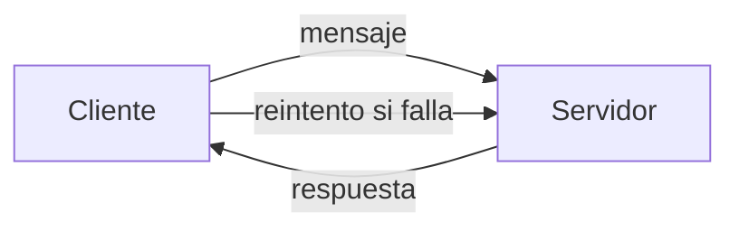
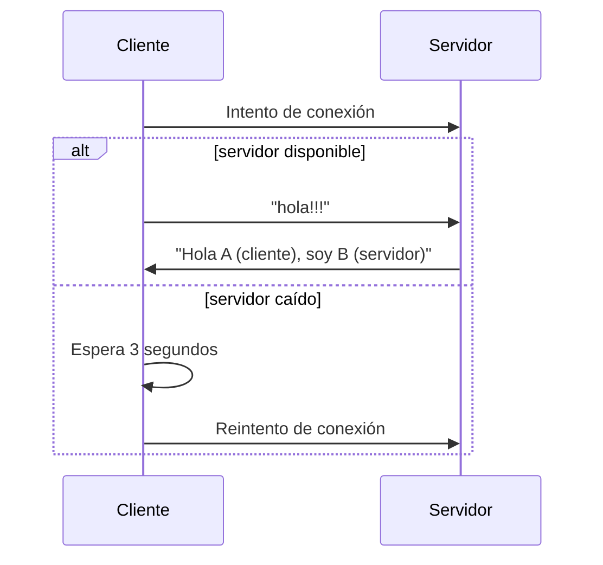

# TP1 - Sistemas Distribuidos  
## Hit 2 - Reconexión automática del cliente

---

# Descripción

En este hit se mejora la implementación del **Hit 1**, agregando un mecanismo de **reconexión automática del cliente** en caso de que el servidor cierre la conexión o no esté disponible.

En sistemas distribuidos reales, las conexiones pueden perderse por múltiples motivos:

- caída del servidor
- interrupciones de red
- cierre abrupto de procesos

Para manejar estos casos, el cliente ahora implementa un **mecanismo de reintento** que intenta reconectarse al servidor cada cierto tiempo hasta lograr establecer la conexión nuevamente.

El comportamiento del sistema ahora es:

1. El cliente intenta conectarse al servidor.
2. Si el servidor está disponible, se envía el saludo.
3. Si la conexión falla, el cliente espera 3 segundos.
4. Luego intenta reconectarse nuevamente.

Este patrón es común en sistemas distribuidos para aumentar la **tolerancia a fallos**.

---

# Tecnologías utilizadas

- Python 3
- Biblioteca estándar `socket`
- Biblioteca `time` para control de reintentos

---

# Estructura del proyecto

```
Hit2/
│
├── cliente.py
├── servidor.py
└── README.md
```

### Descripción de archivos

**cliente.py**

Implementa el cliente con lógica de reconexión automática en caso de pérdida de conexión.

**servidor.py**

Implementa el servidor que acepta una conexión, recibe el mensaje y envía una respuesta.

---

# Diagrama de arquitectura



El cliente intenta conectarse al servidor.  
Si la conexión falla, el cliente espera y vuelve a intentar.

---

# Flujo de comunicación



---

# Instrucciones de ejecución

## 1. Requisitos

Tener instalado **Python 3**.

Verificar instalación:

```bash
python --version
```

---

# 2. Ejecutar el servidor

Abrir una terminal y ejecutar:

```bash
python servidor.py
```

Salida esperada:

```
Servidor esperando conexión...
```

---

# 3. Ejecutar el cliente

En otra terminal ejecutar:

```bash
python cliente.py
```

Salida esperada cuando el servidor está activo:

```
Conectado con el servidor
Mensaje enviado!!!
Mensaje recibido del servidor: Hola A (cliente), soy B (servidor).
```

---

# Ejemplo de reconexión

Si el servidor no está ejecutándose, el cliente mostrará:

```
Conexión perdida. Reintentando en 3 segundos...
```

El cliente seguirá intentando conectarse hasta que el servidor vuelva a estar disponible.

---

# Funcionamiento del código

## Cliente

La mejora principal en este hit se encuentra en el cliente.

Se agregó un **bucle infinito** que intenta conectarse al servidor:

```python
while(True):
```

Dentro del bloque `try`, el cliente intenta:

- crear el socket
- conectarse al servidor
- enviar el mensaje
- recibir la respuesta

Si ocurre un error de conexión, se captura mediante `except`.

---

### Manejo de errores de conexión

Se capturan los siguientes errores:

```python
except (ConnectionRefusedError, ConnectionResetError, ConnectionError):
```

Estos errores ocurren cuando:

- el servidor no está corriendo
- el servidor cerró la conexión
- la conexión se perdió

---

### Mecanismo de reintento

Cuando ocurre un error, el cliente espera 3 segundos antes de intentar nuevamente:

```python
time.sleep(3)
```

Esto evita que el cliente intente reconectarse de forma continua y consuma recursos innecesarios.

---

## Servidor

El servidor funciona de forma similar al Hit 1:

1. Crea un socket TCP.
2. Escucha conexiones entrantes.
3. Acepta una conexión.
4. Recibe el mensaje del cliente.
5. Envía una respuesta.
6. Cierra la conexión.

---

# Decisiones de diseño

Durante la implementación se tomaron las siguientes decisiones:

### Implementar reconexión automática

Se decidió agregar un mecanismo de reconexión para mejorar la **robustez del sistema**, permitiendo que el cliente continúe intentando conectarse cuando el servidor no esté disponible.

---

### Uso de manejo de excepciones

Se utilizó un bloque `try-except` para capturar errores de conexión y evitar que el programa termine abruptamente.

Esto permite manejar fallos de forma controlada.

---

### Intervalo de reintento de 3 segundos

Se eligió un intervalo de **3 segundos** entre reintentos para evitar:

- saturar el servidor
- consumir CPU innecesariamente

Este tipo de estrategia es común en sistemas distribuidos.

---
### Instrucciones para ejecutar el test
## 1. Requisitos

Tener instalado **Pytest**.

Verificar instalación:

```bash
python -m pytest --version
```

---
# 1. Seleccionar ubicacion del Punto 2
Abrir una terminal y ejecutar:
```bash
cd ./TP1/Punto2
```
# 2. Ejecutar el test
Luego utilizar el siguiente comando:


```bash
python -m pytest .\tests\test_hit2.py
```

# Conclusión

Este hit introduce el concepto de **tolerancia a fallos básicos mediante reconexión automática**.

El cliente ahora es capaz de detectar fallos en la conexión y reintentar la comunicación con el servidor de manera automática.

Este tipo de mecanismos son fundamentales en sistemas distribuidos, donde los componentes pueden fallar o reiniciarse en cualquier momento.