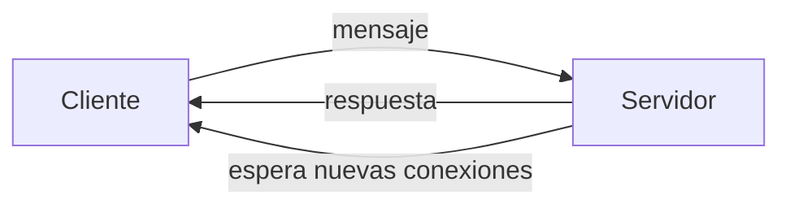
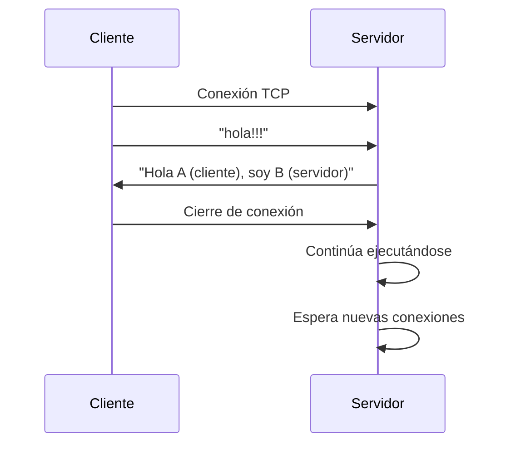

# TP1 - Sistemas Distribuidos  
## Hit 3 - Servidor tolerante al cierre del cliente

---

# Descripción

En este hit se mejora la implementación del **servidor (proceso B)** para que continúe funcionando incluso si el cliente (proceso A) cierra la conexión de forma inesperada.

En el Hit 2 se había implementado tolerancia a fallos del lado del cliente mediante reconexión automática.  
En este hit se introduce **tolerancia a fallos del lado del servidor**, permitiendo que el servidor siga funcionando si el cliente se desconecta abruptamente.

Este comportamiento es importante en sistemas distribuidos reales, donde los clientes pueden:

- cerrarse inesperadamente
- perder conexión de red
- terminar el proceso manualmente

El servidor ahora puede detectar esta situación y continuar esperando nuevas conexiones sin finalizar su ejecución.

---

# Tecnologías utilizadas

- Python 3
- Biblioteca estándar `socket`
- Biblioteca `time` para control de reintentos
- `logging` para el registro de logs
- `threading` para el endpoint y testeo
- `Queue` para el testeo
- `FastAPI` para el endpoint
- `uvicorn` para el endpoint 

---

# Estructura del proyecto

```
Hit3/
│
├── logs/
├── tests/
├── cliente.py
├── servidor.py
└── README.md
```

### Descripción de archivos

**cliente.py**

Implementa el cliente con lógica de reconexión automática en caso de pérdida de conexión.

**servidor.py**

Implementa el servidor que ahora es capaz de continuar ejecutándose incluso si el cliente cierra la conexión abruptamente.

---

# Diagrama de arquitectura



El servidor permanece activo continuamente, aceptando nuevas conexiones incluso si un cliente se desconecta.

---

# Flujo de comunicación



---

# Instrucciones de ejecución

## 1. Requisitos

Tener instalado **Python 3**.

Verificar instalación:

```bash
python --version
```
Instalar dependencias:

```bash
cd ./TP1
```

```
pip install -r requirements.txt
```

---
---
# 2. Seleccionar ubicacion del Punto 3
Abrir una terminal y ejecutar:
```bash
cd ./TP1/Punto3
```

# 3. Ejecutar el servidor

Abrir una terminal y ejecutar:

```bash
python servidor.py
```

Salida esperada:

```
Servidor esperando conexiones...
```

El servidor permanecerá ejecutándose continuamente.

---

# 4. Ejecutar el cliente

En otra terminal ejecutar:

```bash
python cliente.py
```

Salida esperada en el cliente:

```
Conectado con el servidor
Mensaje enviado!!!
Mensaje recibido del servidor: Hola A (cliente), soy B (servidor)
```

Salida esperada en el servidor:

```
Servidor esperando conexiones...
Conectado con: ('127.0.0.1', XXXXX)
Mensaje del cliente: hola!!!
```

---

# Manejo del cierre del cliente

Si el cliente se cierra abruptamente (por ejemplo, terminando el proceso), el servidor detectará la situación y continuará ejecutándose.

Salida posible en el servidor:

```
El cliente cerro la conexión
```


El servidor continuará esperando nuevas conexiones.

---

# Funcionamiento del código

## Servidor

La principal mejora en este hit es la incorporación de un **bucle infinito** que permite al servidor aceptar múltiples conexiones a lo largo del tiempo.

```python
while True:
```

Dentro del bucle el servidor:

1. Espera una nueva conexión.
2. Acepta la conexión del cliente.
3. Recibe los datos enviados.
4. Procesa el mensaje.
5. Envía una respuesta.
6. Cierra la conexión.
7. Vuelve a esperar una nueva conexión.

---

### Detección de cierre de conexión

Cuando el cliente cierra la conexión, el método `recv()` devuelve datos vacíos.

```python
if not datos:
```

Esto permite detectar que el cliente se desconectó.

---

### Manejo de excepciones

También se captura la excepción:

```python
ConnectionResetError
```

Esto ocurre cuando el cliente termina el proceso abruptamente.

En ese caso el servidor simplemente registra el evento y continúa ejecutándose.

---

## Cliente

El cliente mantiene la lógica implementada en el Hit 2:

- intenta conectarse al servidor
- envía un mensaje
- recibe una respuesta
- si falla la conexión, reintenta cada 3 segundos

---

# Decisiones de diseño

Durante la implementación se tomaron las siguientes decisiones:

### Servidor persistente

Se implementó un bucle `while True` para permitir que el servidor continúe aceptando conexiones de múltiples clientes a lo largo del tiempo.

Esto evita que el servidor termine después de atender a un único cliente.

---

### Detección de desconexión

Se decidió verificar si `recv()` devuelve datos vacíos para detectar cuando un cliente cerró la conexión.

Esto permite manejar la situación de manera controlada.

---

### Manejo de excepciones

Se agregó captura de `ConnectionResetError` para evitar que el servidor termine si el cliente se cierra abruptamente.

Esto mejora la robustez del sistema.

---

### Instrucciones para ejecutar el test
## 1. Requisitos

Tener instalado **Pytest**.

Verificar instalación:

```bash
python -m pytest --version
```

---
# 1. Seleccionar ubicacion del Punto 3
Abrir una terminal y ejecutar:
```bash
cd ./TP1/Punto3
```
# 2. Ejecutar el test
Luego utilizar el siguiente comando:


```bash
python -m pytest .\tests\test_hit3.py
```

# Conclusión

En este hit se introduce tolerancia a fallos del lado del servidor, permitiendo que el proceso continúe funcionando incluso cuando un cliente se desconecta inesperadamente.

Esta mejora permite que el servidor sea más robusto y pueda seguir aceptando nuevas conexiones sin necesidad de reiniciarse.

Este tipo de comportamiento es fundamental en sistemas distribuidos donde múltiples clientes pueden conectarse y desconectarse en cualquier momento.