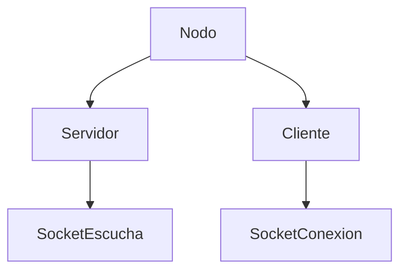
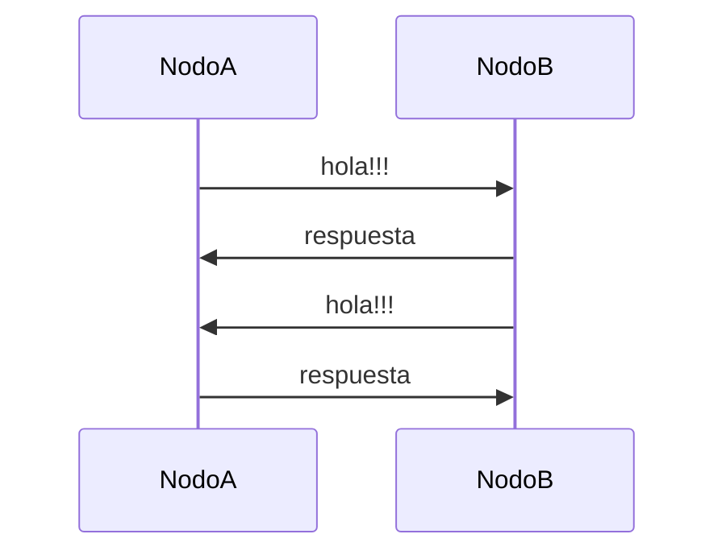

# TP1 - Sistemas Distribuidos  
## Hit 4 - Nodo híbrido cliente/servidor

---

# Descripción

En este hit se refactorizan los programas **A (cliente)** y **B (servidor)** en un único programa denominado **C**, que funciona simultáneamente como **cliente y servidor**.

Cada instancia del programa **C** puede:

- escuchar conexiones entrantes de otros nodos
- conectarse a otro nodo para enviar un saludo

Esto permite que **dos nodos C se saluden mutuamente** utilizando dos canales de comunicación TCP.

Para lograr esto, el programa recibe por parámetros:

- IP y puerto donde escuchar conexiones
- IP y puerto de otro nodo al cual conectarse

De esta forma, al ejecutar dos instancias del programa configuradas entre sí, ambas establecen comunicación bidireccional.

---

# Tecnologías utilizadas

- Python 3
- Biblioteca estándar `socket`
- Biblioteca `threading` para concurrencia
- Biblioteca `time`
- Biblioteca `sys` para recibir parámetros desde línea de comandos

---

# Estructura del proyecto

```
Hit4/
│
├── nodo.py
└── README.md
```

### Descripción de archivos

**nodo.py**

Implementa un nodo que actúa simultáneamente como:

- **servidor TCP**, escuchando conexiones
- **cliente TCP**, enviando mensajes a otro nodo

Esto se logra mediante **dos hilos de ejecución**.

---

# Diagrama de arquitectura


Cada nodo ejecuta:

- un **servidor**
- un **cliente**

Esto genera dos canales de comunicación entre los nodos.

---

# Arquitectura interna del nodo



El nodo ejecuta simultáneamente:

- un servidor que escucha conexiones
- un cliente que intenta conectarse a otro nodo

---

# Flujo de comunicación



Ambos nodos envían y reciben mensajes.

---

# Instrucciones de ejecución

## 1. Requisitos

Tener instalado **Python 3**.

Verificar instalación:

```bash
python --version
```

---

# 2. Ejecutar el primer nodo

Abrir una terminal y ejecutar:

```bash
python nodo.py 127.0.0.1 5000 127.0.0.1 5001
```

Parámetros:

```
IP_escucha
PUERTO_escucha
IP_remota
PUERTO_remoto
```

Este nodo:

- escucha en **5000**
- intenta conectarse a **5001**

---

# 3. Ejecutar el segundo nodo

En otra terminal ejecutar:

```bash
python nodo.py 127.0.0.1 5001 127.0.0.1 5000
```

Este nodo:

- escucha en **5001**
- intenta conectarse a **5000**

---

# Resultado esperado

Ambos nodos se conectarán entre sí y se enviarán mensajes.

Salida típica:

```
Servidor esperando conexiones...
Conectado con el servidor
Mensaje enviado!!!
Mensaje recibido del servidor: Hola A (cliente), soy B (servidor)
```

---

# Funcionamiento del código

El programa está dividido en tres componentes principales:

## Cliente

La función `cliente()` intenta conectarse al nodo remoto y enviar un saludo.

Si la conexión falla, se reintenta cada 3 segundos.

```python
cliente.connect((IP,PUERTO))
```

Luego envía el mensaje:

```python
cliente.send(mensaje.encode('utf-8'))
```

Y espera una respuesta.

---

## Servidor

La función `servidor()` escucha conexiones entrantes.

```python
SocketServer.listen(1)
```

Cuando un cliente se conecta:

1. recibe el mensaje
2. lo muestra por pantalla
3. responde con un saludo
4. cierra la conexión

---

## Concurrencia

Para que el nodo pueda funcionar simultáneamente como cliente y servidor se utilizan **hilos**.

```python
hilo_server = threading.Thread(...)
hilo_cliente = threading.Thread(...)
```

Esto permite que ambas funciones se ejecuten en paralelo.

---

# Decisiones de diseño

Durante la implementación se tomaron las siguientes decisiones:

### Unificación de cliente y servidor

Se decidió integrar ambas funcionalidades en un único programa para representar un **nodo distribuido**, capaz de comunicarse con otros nodos.

---

### Uso de hilos (threading)

Se utilizaron **hilos** para permitir que el nodo:

- escuche conexiones
- se conecte a otros nodos

al mismo tiempo.

---

### Parámetros por línea de comandos

El programa recibe las direcciones IP y puertos como parámetros para permitir ejecutar múltiples nodos con diferentes configuraciones.

Esto facilita las pruebas en entornos distribuidos.

---

### Reintento de conexión

Se mantuvo el mecanismo de reconexión del hit anterior para asegurar que el nodo pueda conectarse incluso si el nodo remoto aún no está disponible.

---

# Conclusión

En este hit se introduce el concepto de **nodo distribuido**, capaz de funcionar simultáneamente como cliente y servidor.

Esto representa un paso importante hacia arquitecturas distribuidas más complejas, donde múltiples nodos pueden comunicarse entre sí de forma bidireccional.

La implementación mediante hilos permite manejar múltiples roles dentro de un mismo proceso, sentando las bases para sistemas distribuidos más avanzados.