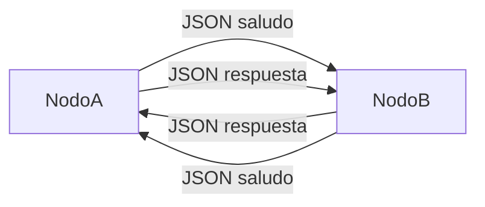
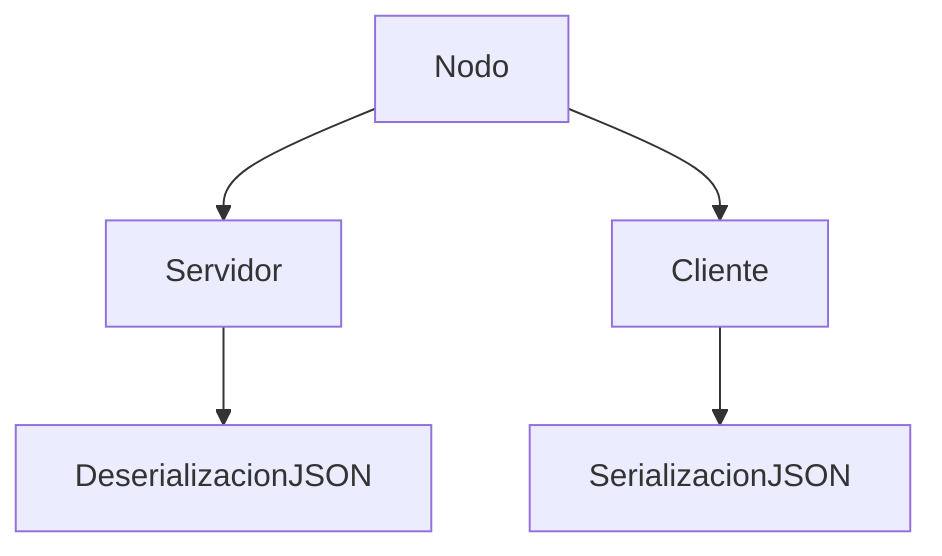
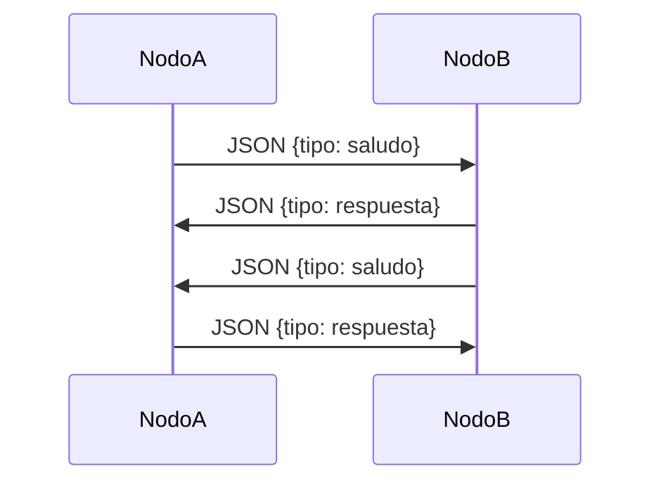

# TP1 - Sistemas Distribuidos  
## Hit 5 - Comunicación entre nodos utilizando JSON

---

# Descripción

En este hit se modifica el programa **C (nodo)** desarrollado en el Hit 4 para que los mensajes intercambiados entre nodos se envíen en **formato JSON**.

Para lograr esto se implementa un proceso de:

- **serialización** al enviar mensajes
- **deserialización** al recibir mensajes

En lugar de enviar texto plano, los nodos ahora intercambian **estructuras de datos JSON**, lo que permite transmitir información estructurada de manera clara y extensible.

Esto representa una práctica común en sistemas distribuidos y aplicaciones de red, ya que JSON es un formato ampliamente utilizado para el intercambio de datos.

---

# Tecnologías utilizadas

- Python 3
- Biblioteca `socket`
- Biblioteca `threading`
- Biblioteca `json`
- Biblioteca `time`
- Biblioteca `sys`

---

# Estructura del proyecto

```
Hit5/
│
├── nodo.py
└── README.md
```

### Descripción de archivos

**nodo.py**

Implementa un nodo distribuido que funciona simultáneamente como:

- cliente TCP
- servidor TCP

Los mensajes intercambiados entre nodos se envían en **formato JSON**.

---

# Diagrama de arquitectura



Cada nodo ejecuta simultáneamente:

- un **servidor** que escucha mensajes
- un **cliente** que envía mensajes

---

# Arquitectura interna del nodo



Los mensajes se transforman entre estructuras de datos y JSON antes de ser enviados o después de ser recibidos.

---

# Flujo de comunicación



---

# Instrucciones de ejecución

## 1. Requisitos

Tener instalado **Python 3**.

Verificar instalación:

```bash
python --version
```

---

# 2. Ejecutar el primer nodo

Abrir una terminal y ejecutar:

```bash
python nodo.py 127.0.0.1 5000 127.0.0.1 5001
```

Este nodo:

- escucha en **5000**
- se conecta al nodo **5001**

---

# 3. Ejecutar el segundo nodo

Abrir otra terminal y ejecutar:

```bash
python nodo.py 127.0.0.1 5001 127.0.0.1 5000
```

Este nodo:

- escucha en **5001**
- se conecta al nodo **5000**

---

# Ejemplo de mensaje JSON

## Mensaje enviado por el cliente

```json
{
  "tipo": "saludo",
  "mensaje": "hola!!!"
}
```

---

## Respuesta del servidor

```json
{
  "tipo": "respuesta",
  "mensaje": "Hola A (cliente), soy B (servidor)"
}
```

---

# Funcionamiento del código

## Serialización de mensajes

Antes de enviar un mensaje, el diccionario de Python se convierte a JSON utilizando:

```python
json.dumps()
```

Ejemplo:

```python
msj = {
    "tipo": "saludo",
    "mensaje": "hola!!!"
}

msj = json.dumps(msj)
```

Luego se envía por el socket.

---

## Deserialización de mensajes

Cuando se recibe un mensaje desde el socket, se convierte nuevamente a estructura de Python utilizando:

```python
json.loads()
```

Ejemplo:

```python
mensaje = json.loads(datos.decode("utf-8"))
```

Esto permite acceder a los campos del mensaje como un diccionario.

---

## Concurrencia

El nodo ejecuta dos hilos:

- **servidor**
- **cliente**

Esto se implementa utilizando la biblioteca `threading`.

```python
hilo_server = threading.Thread(...)
hilo_cliente = threading.Thread(...)
```

---

# Decisiones de diseño

Durante la implementación se tomaron las siguientes decisiones:

### Uso de JSON

Se decidió utilizar JSON porque:

- es un formato estándar de intercambio de datos
- es fácil de leer y depurar
- es ampliamente utilizado en APIs y sistemas distribuidos

---

### Serialización y deserialización

Se utilizaron las funciones:

- `json.dumps()` para serializar
- `json.loads()` para deserializar

Esto permite transformar estructuras de datos de Python en mensajes transmitibles por red.

---

### Mensajes estructurados

Los mensajes ahora contienen campos definidos:

- **tipo** → tipo de mensaje
- **mensaje** → contenido del mensaje

Esto facilita extender el protocolo en futuras versiones.

---

### Reutilización del nodo distribuido

Se mantuvo la arquitectura del Hit 4 donde cada nodo funciona simultáneamente como cliente y servidor.

Esto permite comunicación bidireccional entre nodos.

---

# Conclusión

En este hit se introduce el uso de **JSON como formato de intercambio de datos entre nodos**.

Esto permite enviar mensajes estructurados en lugar de texto plano, facilitando la extensión del protocolo de comunicación y acercando la implementación a sistemas distribuidos reales.

La combinación de nodos cliente/servidor con mensajes JSON representa una arquitectura flexible y extensible para aplicaciones distribuidas.
````
