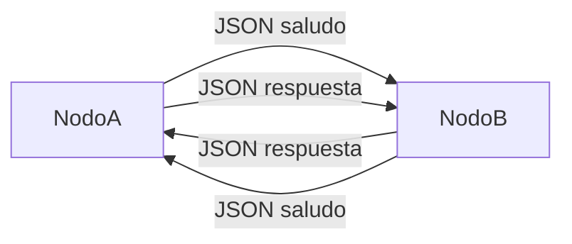
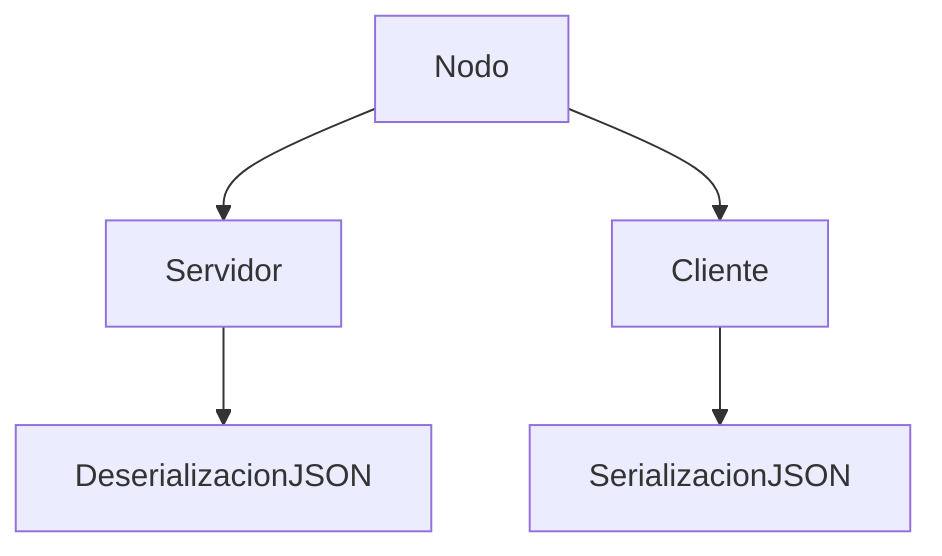
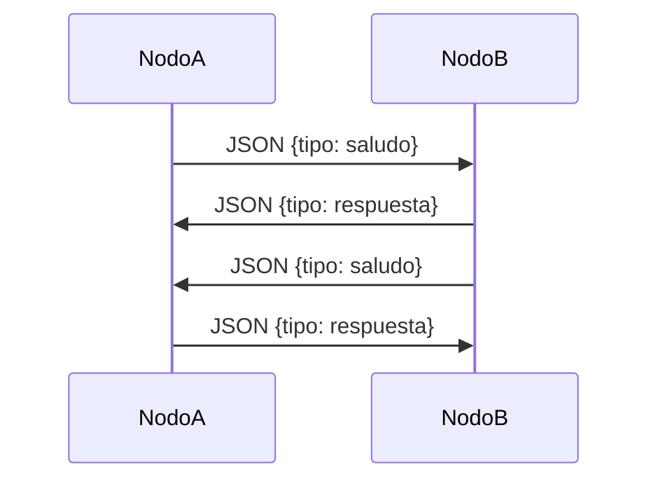

# TP1 - Sistemas Distribuidos

## Hit 5 - Comunicación entre nodos utilizando JSON

---

# Descripción

En este hit se modifica el programa **C (nodo)** desarrollado en el Hit 4 para que los mensajes intercambiados entre nodos se envíen en **formato JSON**.

Para lograr esto se implementa un proceso de:

* **serialización** al enviar mensajes
* **deserialización** al recibir mensajes

En lugar de enviar texto plano, los nodos ahora intercambian **estructuras de datos JSON**, lo que permite transmitir información estructurada de manera clara y extensible.

Esto representa una práctica común en sistemas distribuidos y aplicaciones de red, ya que JSON es un formato ampliamente utilizado para el intercambio de datos.

---

# Tecnologías utilizadas

* Python 3
* Biblioteca `socket`
* Biblioteca `threading`
* Biblioteca `json`
* Biblioteca `time`
* Biblioteca `sys`
* Flask (endpoint de monitoreo)
* unittest (testing)

---

# Estructura del proyecto

```
Hit5/
│
├── nodo.py
├── log/
├── tests/
│   ├── __init__.py
│   └── test_nodo_json.py
└── README.md
```

### Descripción de archivos

**nodo.py**

Implementa un nodo distribuido que funciona simultáneamente como:

* cliente TCP
* servidor TCP

Los mensajes intercambiados entre nodos se envían en **formato JSON**.

---

# Diagrama de arquitectura



---

# Arquitectura interna del nodo



---

# Flujo de comunicación



---

# Instrucciones de ejecución

## 1. Requisitos

Tener instalado **Python 3**.

Verificar instalación:

```bash
python --version
```

---

## Instalación de dependencias

```bash
pip install flask
```

---

# 2. Ejecutar el primer nodo

```bash
python nodo.py 127.0.0.1 5000 127.0.0.1 5001
```

---

# 3. Ejecutar el segundo nodo

```bash
python nodo.py 127.0.0.1 5001 127.0.0.1 5000
```

---

# Ejemplo de mensaje JSON

## Mensaje enviado por el cliente

```json
{
  "tipo": "saludo",
  "mensaje": "hola!!!"
}
```

---

## Respuesta del servidor

```json
{
  "tipo": "respuesta",
  "mensaje": "Hola A (cliente), soy B (servidor)"
}
```

---

# Funcionamiento del código

## Serialización de mensajes

```python
json.dumps()
```

---

## Deserialización de mensajes

```python
json.loads()
```

---

## Concurrencia

Se utilizan dos hilos:

* servidor
* cliente

---

# Logs del sistema

El sistema implementa un mecanismo de logging que registra eventos tanto en memoria como en disco.

Los logs incluyen:

* conexiones de cliente y servidor
* mensajes enviados y recibidos
* errores de conexión

Los logs se almacenan en:

```
log/nodo_json.log
```

Esto permite auditoría y seguimiento del comportamiento del sistema.

---

# Pruebas automatizadas

Se implementan pruebas unitarias y de integración utilizando `unittest`.

## Ejecutar tests

```bash
python -m unittest discover -s tests -t . -v
```

Las pruebas verifican:

* serialización y deserialización JSON
* funcionamiento del sistema de logs
* comunicación entre cliente y servidor

---

# Endpoint de monitoreo (Health Check)

Se implementa un endpoint HTTP que permite verificar el estado del nodo.

## URL

```
http://localhost:8000/health
```

## Ejemplo de respuesta

```json
{
  "servidor": "OK",
  "cliente": "OK",
  "logs": "OK"
}
```

Este endpoint permite monitorear:

* estado del servidor
* estado del cliente
* estado del sistema de logs

---

# Decisiones de diseño

### Uso de JSON

* formato estándar
* fácil de leer
* extensible

---

### Logs

Se incorporó un sistema de logging para mejorar la observabilidad del sistema y facilitar debugging.

---

### Testing

Se agregaron pruebas automatizadas para validar el comportamiento del sistema.

---

### Endpoint de monitoreo

Se implementó un endpoint `/health` para exponer el estado del sistema, siguiendo prácticas comunes en sistemas distribuidos.

---

# Conclusión

En este hit se introduce el uso de **JSON como formato de intercambio de datos entre nodos**, junto con mejoras en:

* observabilidad (logs)
* validación (tests)
* monitoreo (endpoint `/health`)

Esto acerca la implementación a sistemas distribuidos reales y mejora la robustez del sistema.
