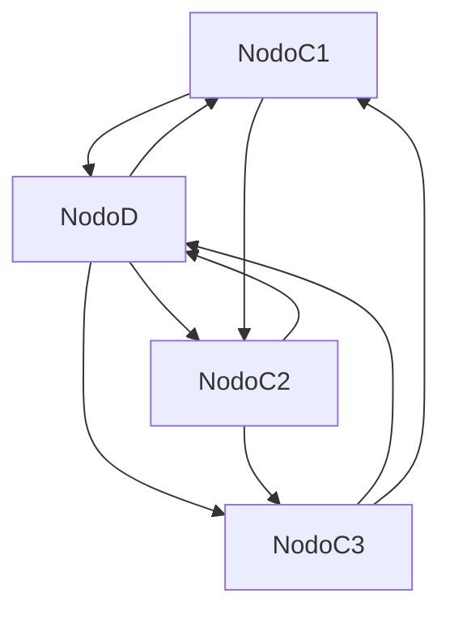
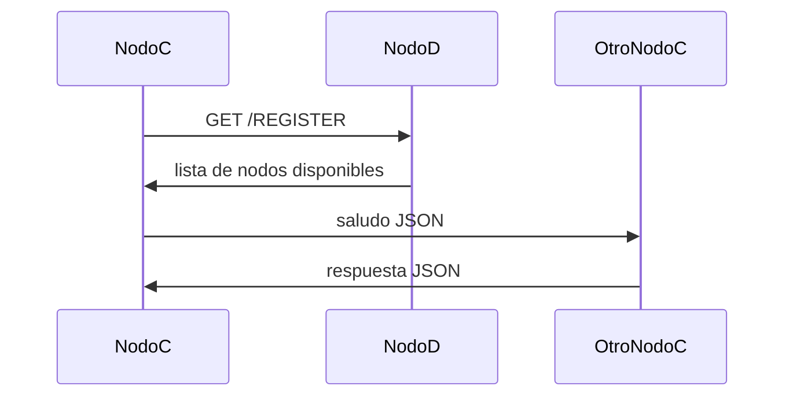

# TP1 - Sistemas Distribuidos  
## Hit 6 - Registro de nodos y descubrimiento dinámico

---

# Descripción

En este hit se introduce un **nuevo tipo de nodo llamado D**, cuyo objetivo es actuar como **registro de contactos** para los nodos C.

En los hits anteriores, cada nodo C debía conocer manualmente la IP y el puerto de otro nodo para comunicarse. En esta nueva versión se implementa un mecanismo de **descubrimiento dinámico de nodos**.

El nodo **D** mantiene un **registro en memoria (RAM)** con todos los nodos C que se registran en el sistema.

Cuando un nodo **C inicia**, realiza los siguientes pasos:

1. Inicia su servidor TCP en un **puerto aleatorio**.
2. Se registra en el **nodo D** enviando una solicitud HTTP.
3. El nodo **D** agrega ese nodo al registro.
4. El nodo **D** responde con la lista de nodos disponibles.
5. El nodo **C** se conecta a cada uno de ellos y envía un saludo.

De esta forma, los nodos **ya no necesitan conocer manualmente a sus pares**, permitiendo escalar el sistema a múltiples instancias.

---

# Tecnologías utilizadas

### Nodo C
- Python 3
- `socket`
- `threading`
- `json`
- `requests`

### Nodo D
- Python 3
- `FastAPI`
- `uvicorn`

---

# Estructura del proyecto

```
Hit6/
│
├── nodoC.py
├── nodoD.py
└── README.md
```

### Descripción de archivos

**nodoC.py**

Nodo distribuido que:

- actúa como servidor TCP
- se registra en nodo D
- descubre otros nodos
- envía saludos a los demás nodos

---

**nodoD.py**

Nodo de registro que:

- mantiene una lista de nodos activos
- permite registrar nuevos nodos
- expone un endpoint `/health` para monitoreo

---

# Arquitectura del sistema



El nodo **D** funciona como un **servicio de descubrimiento de nodos**.

---

# Flujo de registro y descubrimiento



---

# Endpoint de monitoreo

El nodo **D** expone el endpoint público:

```
/health
```

Este endpoint devuelve el estado del servicio en **formato JSON**.

Ejemplo de respuesta:

```json
{
  "Cantidad de nodos registrados": 3,
  "uptime": 120.54,
  "Estado": "OK"
}
```

Información incluida:

- cantidad de nodos registrados
- tiempo de funcionamiento del servicio
- estado general del sistema

---

# Registro de nodos

Cuando un nodo C se registra, el nodo D almacena en RAM:

```python
registro = [
  {
    "ip": "127.0.0.1",
    "puerto": 50123
  }
]
```

Cada nodo registrado incluye:

- IP
- puerto TCP donde escucha

---

# Instrucciones de ejecución

## 1. Instalar dependencias

Instalar las librerías necesarias:

```bash
pip install fastapi uvicorn requests
```

---

# 2. Ejecutar el nodo D (registro)

Ejecutar el servidor HTTP con:

```bash
python -m uvicorn nodoD:app --host 127.0.0.1 --port 1234
```

El nodo D quedará escuchando en:

```
http://localhost:8000
```

---

# 3. Verificar health check

Abrir en el navegador:

```
http://localhost:8000/health
```

Respuesta esperada:

```json
{
  "Cantidad de nodos registrados": 0,
  "uptime": 3.42,
  "Estado": "OK"
}
```

---

# 4. Ejecutar nodos C

En nuevas terminales ejecutar:

```
python nodoC.py 127.0.0.1 1234
```

Parámetros:

```
IP del nodo D
Puerto del nodo D
```

Ejemplo:

```
python nodoC.py 127.0.0.1 1234
```

---

# Resultado esperado

Cada nodo C:

1. se registra en el nodo D
2. recibe la lista de nodos disponibles
3. se conecta a ellos
4. envía un saludo en JSON

Salida esperada:

```
Se registro un nuevo nodo C
Conectado con el servidor
Mensaje enviado!!!
Mensaje recibido del servidor
```

---

# Funcionamiento del nodo C

El nodo C realiza tres tareas principales.

---

## 1. Registro en nodo D

Se envía una petición HTTP:

```python
requests.get("http://IP_D:PUERTO_D/REGISTER")
```

El nodo D devuelve los nodos registrados.

---

## 2. Inicio del servidor TCP

El nodo inicia un servidor para recibir mensajes de otros nodos.

```python
SocketServer.bind((IP, PUERTO))
SocketServer.listen(1)
```

---

## 3. Conexión a otros nodos

El nodo C se conecta a cada nodo recibido en el registro y envía un saludo.

---

# Funcionamiento del nodo D

El nodo D mantiene un registro en memoria:

```python
registro = []
```

Cada vez que un nodo se registra:

1. obtiene la IP y puerto del cliente
2. lo agrega al registro
3. devuelve la lista completa de nodos

---

# Endpoint /REGISTER

Cuando un nodo C realiza la petición:

```
GET /REGISTER
```

El nodo D:

1. registra el nodo
2. devuelve los nodos disponibles

Ejemplo de respuesta:

```json
{
  "nodosDisponibles": [
    {"ip": "127.0.0.1", "puerto": 50123},
    {"ip": "127.0.0.1", "puerto": 50130}
  ]
}
```

---

# Decisiones de diseño

Durante la implementación se tomaron las siguientes decisiones.

---

### Nodo de descubrimiento centralizado

Se implementó un nodo **D** para simplificar el descubrimiento de nodos.

Esto evita que los nodos C deban conocer manualmente a sus pares.

---

### Registro en memoria (RAM)

El registro se mantiene en un **array en memoria** por simplicidad.

Ventajas:

- implementación sencilla
- rápido acceso

Desventaja:

- los datos se pierden al reiniciar el servicio.

---

### Uso de FastAPI

Se eligió **FastAPI** para implementar el nodo D porque:

- es liviano
- fácil de implementar
- ideal para APIs REST.

---

### Endpoint de health check

Se implementó `/health` para permitir monitorear el estado del sistema.

Esto es una práctica común en sistemas distribuidos y microservicios.

---

### Descubrimiento automático de nodos

Los nodos C obtienen dinámicamente la lista de nodos activos desde el registro.

Esto permite escalar el sistema a múltiples nodos sin configuración manual.

---

# Conclusión

En este hit se introduce un **mecanismo de descubrimiento de nodos** mediante un **registro centralizado (nodo D)**.

Esto permite que múltiples instancias de nodos C se registren automáticamente y se comuniquen entre sí sin necesidad de configuración manual, acercando el sistema a una arquitectura distribuida más realista.