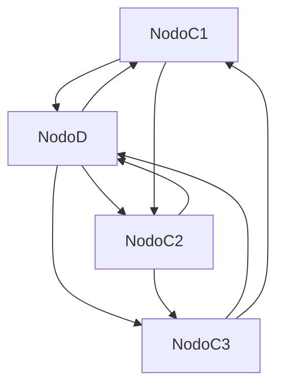
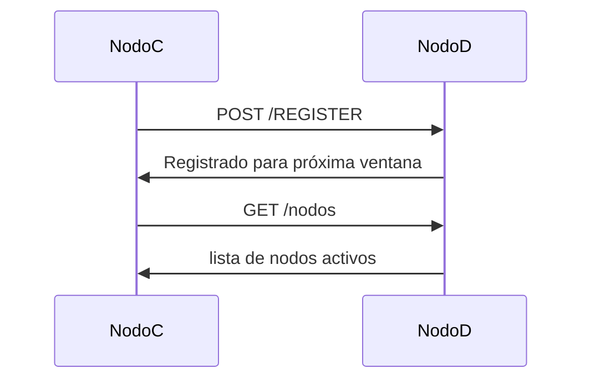

# TP1 - Sistemas Distribuidos  
## Hit 7 - Sistema de inscripciones por ventanas de tiempo

---

# Descripción

En este hit se introduce un **sistema de inscripciones basado en ventanas de tiempo** coordinado por el nodo **D**.

El objetivo es controlar cuándo los nodos **C** pueden participar en el sistema, utilizando **intervalos de inscripción de 1 minuto**.

Cuando un nodo C se registra en el nodo D, su inscripción **no se vuelve activa inmediatamente**, sino que se agenda para la **siguiente ventana de tiempo**.

Por ejemplo:

- un nodo C se registra a las **11:28:34**
- su inscripción será válida recién a las **11:29:00**

Durante cada ventana:

- los nodos **C activos** pueden descubrirse entre sí
- los nodos **que se registren durante esa ventana** quedarán programados para la **siguiente ventana**

Esto simula un sistema distribuido donde los participantes se activan en **rondas coordinadas**.

---

# Componentes del sistema

El sistema ahora posee **dos tipos de nodos**.

### Nodo C

Nodo participante que:

- inicia un servidor TCP
- se registra en el nodo D
- consulta los nodos activos
- se conecta a ellos y envía saludos

---

### Nodo D

Nodo coordinador que:

- gestiona las ventanas de inscripción
- mantiene registros de nodos
- guarda los registros en un archivo JSON
- expone endpoints HTTP para interacción y monitoreo

---

# Estructura del proyecto

```
Hit7/
│
├── nodoC.py
├── nodoD.py
├── registro_nodos.json
└── README.md
```

---

# Arquitectura del sistema



El nodo **D** coordina las inscripciones y permite que los nodos **C** se descubran entre sí.

---

# Sistema de ventanas de tiempo

El nodo **D** maneja dos registros diferentes:

- **nodos_activos** → nodos activos en la ventana actual
- **nodos_siguientes** → nodos registrados para la próxima ventana

Cada **60 segundos** ocurre la transición:

```
nodos_siguientes → nodos_activos
nodos_siguientes = []
```

Esto inicia una **nueva ronda de participación**.

---

# Flujo de inscripción



---

# Persistencia de datos

El nodo **D** guarda el estado del sistema en el archivo:

```
registro_nodos.json
```

Ejemplo de contenido:

```json
{
  "nodos_activos": [
    {
      "ip": "127.0.0.1",
      "puerto": 50123
    }
  ],
  "nodos_siguientes": [
    {
      "ip": "127.0.0.1",
      "puerto": 50140
    }
  ]
}
```

Esto permite:

- verificar el estado del sistema
- analizar ejecuciones
- facilitar el debugging

---

# Endpoints del nodo D

## Registrar nodo

```
POST /REGISTER
```

Body:

```json
{
  "ip": "127.0.0.1",
  "puerto": 50123
}
```

Respuesta:

```json
{
  "mensaje": "Registrado para la próxima ventana"
}
```

---

# Obtener nodos activos

```
GET /nodos
```

Respuesta:

```json
{
  "nodos": [
    {
      "ip": "127.0.0.1",
      "puerto": 50123
    }
  ]
}
```

---

# Health check del sistema

```
GET /health
```

Respuesta:

```json
{
  "estado": "OK",
  "nodos_activos": 2,
  "uptime": 120.52
}
```

---

# Instrucciones de ejecución

## 1. Instalar dependencias

```bash
pip install fastapi uvicorn requests
```

---

# 2. Ejecutar nodo D

Iniciar el coordinador:

```bash
python -m uvicorn nodoD:app --host 127.0.0.1 --port 8000
```

Esto inicia el servidor HTTP del nodo D.

---

# 3. Ejecutar nodos C

En nuevas terminales ejecutar:

```bash
python nodoC.py 127.0.0.1 8000
```

Parámetros:

```
IP del nodo D
Puerto del nodo D
```

Ejemplo:

```
python nodoC.py 127.0.0.1 8000
```

---

# Resultado esperado

Cuando se ejecutan varios nodos C:

1. Cada nodo se registra en D.
2. El nodo queda en la lista **nodos_siguientes**.
3. Al comenzar la próxima ventana (cada 60 segundos):
   - los nodos pasan a **nodos_activos**.
4. Los nodos C consultan periódicamente los nodos activos.
5. Se conectan entre sí y envían saludos.

---

# Funcionamiento del nodo D

El nodo D ejecuta un **hilo de control de ventanas**.

```python
threading.Thread(target=controlar_ventanas, daemon=True).start()
```

Este hilo:

- espera 60 segundos
- mueve nodos registrados a la lista activa
- limpia la lista de inscripciones futuras
- guarda el estado en el archivo JSON

---

# Funcionamiento del nodo C

El nodo C realiza las siguientes tareas:

### 1. Genera un puerto aleatorio

```python
servidor_socket.bind(("0.0.0.0", 0))
```

El sistema operativo asigna automáticamente el puerto.

---

### 2. Inicia su servidor TCP

Esto permite recibir mensajes de otros nodos.

---

### 3. Se registra en nodo D

```python
requests.post("/REGISTER")
```

---

### 4. Consulta nodos activos

```python
requests.get("/nodos")
```

---

### 5. Se conecta a los nodos activos

Cada nodo activo recibe un mensaje de saludo en formato JSON.

---

# Decisiones de diseño

Durante la implementación se tomaron las siguientes decisiones.

---

### Ventanas de inscripción de 1 minuto

Permite simular rondas coordinadas de participación en el sistema distribuido.

---

### Dos registros de nodos

Se utilizan dos listas:

- nodos activos
- nodos para la próxima ventana

Esto simplifica la transición entre ventanas.

---

### Persistencia en JSON

El archivo `registro_nodos.json` permite:

- registrar el estado del sistema
- verificar resultados
- facilitar debugging

---

### Hilo de control de ventanas

El nodo D utiliza un hilo que cada 60 segundos actualiza el estado de las inscripciones.

Esto automatiza la transición entre ventanas.

---

### Puerto aleatorio para nodos C

Cada nodo C utiliza un puerto dinámico para evitar conflictos entre múltiples instancias.

---

# Conclusión

En este hit se implementa un **sistema de inscripciones coordinado por ventanas de tiempo**, permitiendo organizar la participación de nodos en rondas.

El nodo **D** actúa como coordinador del sistema, mientras que los nodos **C** consultan dinámicamente los participantes activos.

Este mecanismo introduce conceptos importantes de sistemas distribuidos como:

- coordinación centralizada
- ventanas temporales
- persistencia de estado
- descubrimiento dinámico de nodos.