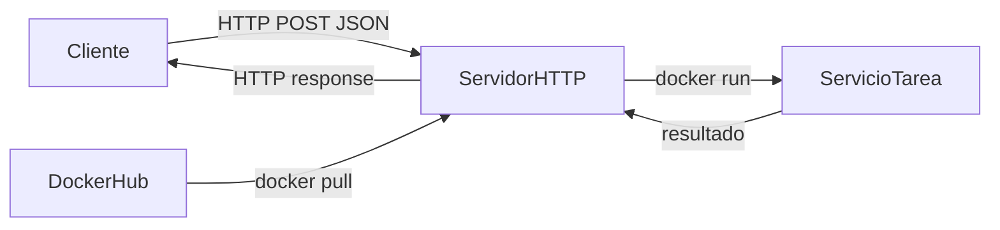
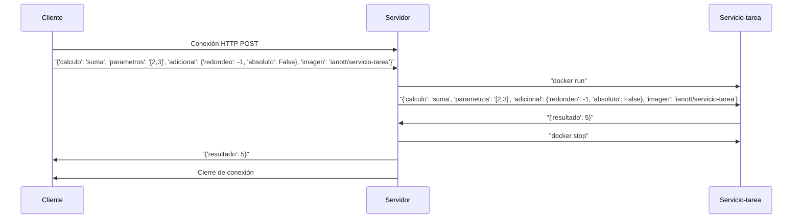

# TP2 - Sistemas Distribuidos  
## Hit 1 - Cliente/Servidor con Tareas Docker

---
# Descripción

En este primer hit se implementa un sistema de **comunicación cliente-servidor mediante HTTP para resolver tareas genericas o precompiladas usando docker e implementado en Python**.

El objetivo es comprender cómo los procesos cliente/servidor pueden comunicarse a través de la red utilizando contenedores docker para alojar al servidor y al servicio tarea.

El funcionamiento general del sistema es el siguiente:

1. El servidor se inicia en su contenedor y queda escuchando conexiones entrantes.
2. El cliente se conecta al servidor mediante HTTP.
3. El cliente envía un mensaje con el calculo a realizar.
4. El servidor recibe el mensaje y una vez obtenido el contenedor servicio tarea mediante un repositorio privado lo ejecuta para obtener el resultado.
5. El servicio tarea procesa los datos y envia el resultado al servidor.
6. El servidor recibe la respuesta, detiene el contenedor de servicio tarea y envia el resultado al cliente.
7. El cliente obtiene la respuesta y cierra la conexion.


---

# Tecnologías utilizadas

- Python 3
- Biblioteca estándar `socket`
- Docker
- FastAPI 
- Request
- time
- logging
- os
- subprocess
- requests

---

# Estructura del proyecto

```
Hit1/
│
├── /logs
├── /tests
├── cliente.py
├── docker.py
├── README.md
├── requirements.txt
├── servicio-tarea.dockerfile
├── servidor.dockerfile
└── servidor.py

```

### Descripción de archivos

**cliente.py**

Implementa el cliente que se conecta al servidor, envía un calculo a realizar y recibe la respuesta.

**servidor.py**

Implementa la funcionalidad del contenedor servidor que escucha conexiones entrantes, recibe mensajes, descarga la imagen servicio tarea de un repositorio privado, lo ejecuta a su contenedor para obtener la respuesta y una vez que la obtiene detiene el contenedor servicio-tarea y responde al cliente.

**docker.py**

Implementa la funcionalidad del contenedor docker servicio-tarea donde resuleve la tarea generica y responde al servidor.

**servicio-tarea.dockerfile**

Se utiliza para construir la imagen docker del servicio-tarea que luego es subida al repositorio privado por los alumnos. 

**servidor.dockerfile**

Se utiliza para construir la imagen docker del servidor localmente para luego poder ejecutar el contenedor del servidor. (mediante el comando docker build)

---

# Diagrama de arquitectura



El cliente inicia la comunicación enviando un mensaje al servidor mediante **HTTP**.  
El servidor en su contenedor procesa el mensaje, hace docker pull si no tiene la imagen, ejecuta el contenedor servicio-tarea y responde al cliente una vez obtiene la resuesta del contenedor servicio-tarea.
El contenedor Servicio-tarea procesa la tarea asignada y devuelve el resultado al servidor.

---

# Flujo de comunicación



---
# Pasos para ejecutar el Punto 1
## 1. Requisitos

Tener instalado **Python 3**.

Verificar instalación:

```bash
python --version
```
Tener instalado **Docker**.

Verificar instalación:

```bash
docker --version
```
Instalar dependencias:

```bash
cd ./TP2
```

```
pip install -r requirements.txt
```
---
# 2. Seleccionar ubicacion del Punto 1
Abrir una terminal y ejecutar:
```bash
cd ./TP2/Punto1
```
---
# 3. Ingresar con usuario docker solo lectura
```bash
docker login -u ianott
```
---
Luego ingresar el token:
```bash
(solicitar token no pudo ser subido)
```
---
# 4. Descargar la imagen de servicio-tarea del repositorio privado

```bash
docker pull ianott/servicio-tarea
```
---
# 5. Configurar contenedor docker del servidor

```bash
docker build -t servidor:1.0 -f servidor.dockerfile .
```
---

# 6. Crear Red para comunicar contenedores


```bash
docker network create red_docker
```

# 7. Ejecutar el servidor


```bash
docker run --network red_docker -v /var/run/docker.sock:/var/run/docker.sock -d -i --name servidor -p 7685:7685 servidor:1.0
```

Salida esperada:

```
2026-04-06 16:58:54,679 - INFO - Se inicio correctamente el servidor

INFO:     Started server process [1]

INFO:     Waiting for application startup.

INFO:     Application startup complete.

INFO:     Uvicorn running on http://0.0.0.0:7685 (Press CTRL+C to quit)
```

---

# 8. Ejecutar el cliente

En otra terminal ejecutar:

```bash
python cliente.py <tipo solicitud> <calculo> <parametros> <adicional> <imagen>

Ejemplo:
python cliente.py POST suma [2,3] [] ianott/servicio-tarea

```

Salida esperada del lado del servidor cuando está activo:

```
2026-04-06 16:58:55,513 - INFO - Se esta procesando una nueva tarea mediante POST: {'calculo': 'suma', 'parametros': '[2,3]', 'adicional': {'redondeo': -1, 'absoluto': False}, 'imagen': 'ianott/servicio-tarea'}

INFO:     172.18.0.1:59504 - "POST /getRemoteTask HTTP/1.1" 200 OK
```
Salida esperada del lado del cliente:
2026-04-06 17:00:14,787 - INFO - {'resultado': 5}


Nota: en adicional la primera posicion de la lista se refiere al redondeo de los numeros por lo que si su valor es mayor a cero se redondeara el resultado a esa cantidad de decimales. 
Ademas, la segunda posicion de la lista refiere a valor absoluto que puede ser True o False y en caso que sea True el resultado sera devuelto con valor absoluto. (si no lo quiere usar con ingresar una lista vacia alcanza)
---
# Metodos disponibles

Para visualizar los metodos disponibles en docker ejecute el siguiente comando: 
python cliente.py METODOS ianott/servicio-tarea 

En el caso que se quiera borrar la imagen del servidor use el siguiente comando:
docker rm -f servidor
o en todo caso primero detenga el contenedor:
docker stop servidor
Y luego eliminelo:
docker rm servidor

### Instrucciones para ejecutar el test
## 1. Requisitos

Tener instalado **Pytest**.

Verificar instalación:

```bash
python -m pytest --version
```

Tener instalado **Docker**.

Verificar instalación:

```bash
docker --version
```
Instalar dependencias:

```bash
cd ./TP2
```

```
pip install -r requirements.txt
```
---
# 2. Seleccionar ubicacion del Punto 1
Abrir una terminal y ejecutar:
```bash
cd ./TP2/Punto1
```
---
# 3. Ingresar con usuario docker solo lectura
```bash
docker login -u ianott
```
---
Luego ingresar el token:
```bash
(solicitar token no pudo ser subido)
```
---
# 3. Ejecutar el test
Luego utilizar el siguiente comando:

```bash
python -m pytest .\tests\test_hit1.py
```
---

# Funcionamiento del cliente

El cliente dispone de tres solicitudes disponibles.

---

## 1. solicitud HTTP GET para comunicarse con el servidor

Se envía una petición HTTP GET:

```python
requests.get("http://localhost:7685/getRemoteTask",params= {
            "calculo":calculo,
            "parametros": parametros,
            "redondeo": adicionalT["redondeo"],
            "absoluto":adicionalT["absoluto"],
            "imagen": imagen
        }, stream = True)
```

El servidor devuelve el resultado procesado por el servicio-tarea

---

## 2. solicitud HTTP POST para comunicarse con el servidor

Se envía una petición HTTP POST:

```python
requests.post("http://localhost:7685/getRemoteTask",json=tarea, stream = True)
```
El servidor devuelve el resultado procesado por el servicio-tarea
---

## 3. solicitud HTTP GET para comunicarse con el servidor y obtener los metodos disponibles

Se envía una petición HTTP POST:

```python
requests.get("http://localhost:7685/getMetodos",params= {"imagen":imagen}, stream = True)
```
---

# Funcionamiento del servidor

El servidor tiene los siguientes endpoints:

---

# Endpoint /getRemoteTask

Cuando un cliente realiza la petición:

```
GET /getRemoteTask o
POST /getRemoteTask
```

El servidor:

1. ejecuta el servicio-tarea mediante docker run (si el contenedor ya existe solo se inicia con docker start)
2. Se envia una peticion HTTP POST al contenedor servicio-tarea
3. El servidor obtiene la respuesta y la devuelve al cliente

Ejemplo de respuesta:

```json
{
  {"resultado": 5}
}
```

# Endpoint /getMetodos

Cuando un cliente realiza la petición:

```
GET /getMetodos
```

El servidor:

1. ejecuta el servicio-tarea mediante docker run (si el contenedor ya existe solo se inicia con docker start)
2. Se envia una peticion HTTP GET al contenedor servicio-tarea de los metodos
3. El servidor obtiene la respuesta y la devuelve al cliente

Ejemplo de respuesta:

```json
{
  {"metodos": ["suma", "resta", "multiplicacion", "division"]}
}
```
---

# Decisiones de diseño

Durante la implementación se tomaron las siguientes decisiones.

---

### Seguridad

En este hit las credenciales de acceso al registro docker no son enviados en el payload del request sino que se opto por una configuracion previa del host. Esto significa que antes de utilizar el sistema se debe hacer login del usuario y ha sido generado un token de solo lectura para el repositorio que puede utilizarse para ingresar. Una vez que el login es realizado el servidor docker hace pull de los archivos del repositorio y los obtiene sin problema. 
Esta solucion es mas segura que enviar usuario y contraseña en el JSON porque se evita enviar credenciales a traves de internet sin nigun tipo de seguridad ya que el metodo HTTP que se utiliza en este hit podria considerarse inseguro.

---


### Uso de FastAPI

Se eligió **FastAPI** para implementar el servidor y programa docker porque:

- es liviano
- fácil de implementar
- ideal para APIs REST.

---

### Endpoint de health check

Se implementó `/health` para permitir monitorear el estado del sistema.


---
# Conclusión

En este hit se introduce una **Arquitectura Cliente/Servidor con Tareas Docker** mediante un **servicio-tarea subido a un repositorio privado**.

Esto permite que un cliente se comunique con un servidor implementado en contenedor para resolver tareas genericas mediante un servicio-tarea. Ademas, pudimos entender como comunicar distintos contenedores a traves de la red.

