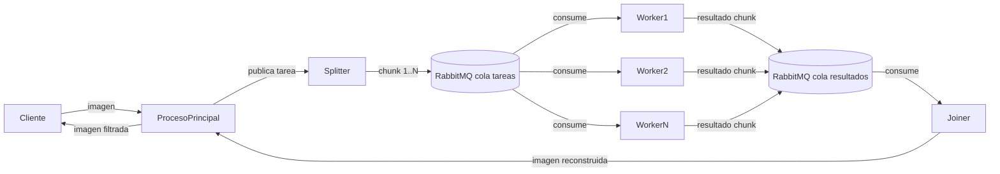
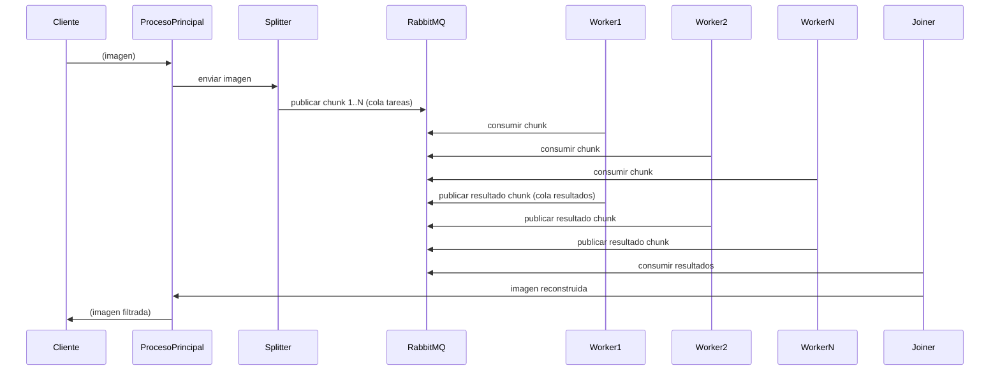

# TP3 - Sistemas Distribuidos  
## Hit 1 - Sobel Distribuido con Workers Docker

---
# Descripción

En este primer hit se implementa los siguientes sistemas:
# Etapa 1 - Operador Sobel **Proceso centralizado que procesa imagenes mediante sobel y genera un archivo resultado implementado en Python**.

El objetivo es comprender cómo funciona el operador sobel
El funcionamiento general del sistema es el siguiente:

1. El Joiner procesa de manera centralizada una imagen para la deteccion de bordes y devuelve un archivo resultado

# Etapa 2 - Sobel Distribuido **Master-Worker Distribuido para procesar imagenes en N pedazos y unificarlas en un archivo resultado usando kubernetes e implementado en Python**.

El objetivo es comprender cómo funciona el operador sobel y como los procesos Splitter, Worker y Joiner pueden comunicarse y trabajar juntos a traves de RabbitMQ. Tambien comprender como mediante kubernetes se puede alojar al servicio de RabbitMQ y a los workers.

El funcionamiento general del sistema es el siguiente:

1. El Proceso Principal se encarga e inicia los procesos Splitter y Joiner pasando la imagen recibida. El Joiner queda esperando mensajes de la cola "resultados".
2. El Splitter divide la imagen en N pedazos y la envia mediante la cola de "tareas" definida de RabbitMQ a los workers.
3. Los workers que ya deberian de estar esperando mensajes y funcionando mediante Kubernetes anteriormente, reciben el fragmento de la imagen, procesan mediante sobel el fragmento recibido y envian a la cola "resultados" su procesamiento.
4. El Joiner recibe los fragmentos y una vez que obtiene todos los unifica y devuelve el archivo resultado


# Etapa 3 **Master-Worker Distribuido con tolerancia a fallos para procesar imagenes en N pedazos y unificarlas en un archivo resultado usando kubernetes e implementado en Python**.

El objetivo es comprender cómo funciona el operador sobel y como los procesos Splitter, Worker y Joiner pueden comunicarse con tolerancia a fallos y trabajar juntos a traves de RabbitMQ. Tambien comprender como mediante kubernetes se puede alojar al servicio de RabbitMQ y a los workers. 

El funcionamiento general del sistema es el siguiente:

1. El Proceso Principal se encarga e inicia los procesos Splitter y Joiner pasando la imagen recibida. El Joiner queda esperando mensajes de la cola "resultados".
2. El Splitter divide la imagen en N pedazos y la envia mediante la cola de "tareas" definida de RabbitMQ a los workers.
3. Los workers que ya deberian de estar esperando mensajes y funcionando mediante Kubernetes anteriormente, reciben el fragmento de la imagen, procesan mediante sobel el fragmento recibido y envian a la cola "resultados" su procesamiento.
4. El Joiner recibe los fragmentos y una vez que obtiene todos los unifica y devuelve el archivo resultado


---

# Tecnologías utilizadas

- Python 3
- Docker
- FastAPI 
- k3d
- time
- Image
- Path
- uvicorn
- threading
- pika
- base64
- json
- time
- logging
- os
- subprocess
- queue


---

# Estructura del proyecto

```
Hit1/
│
├── /etapa1
│   │
│   └──sobel.py
├── /etapa2
│   │
│   ├──joiner.py
│   ├──ProcesoPrincipal.py
│   ├──sobel.py
│   ├──splitter.py
│   └──worker.py
├── /etapa3
│   │
│   ├──joiner.py
│   ├──ProcesoPrincipal.py
│   ├──sobel.py
│   ├──splitter.py
│   └──worker.py
├── /logs
├── /tests
├── /videos
├── Dockerfile
├── fc.jpg (ejemplo de resultado)
├── FondoCristiano.jpg (imagen usada de ejemplo)
├── rabbitmq.yaml
├── README.md
├── requirements.txt
└── workers.yaml

```

### Descripción de archivos

**sobel.py**

Implementa la operacion sobel que es una máscara que, aplicada a una imagen, permite detectar (resaltar) bordes. Es una operación matemática que, aplicada a cada píxel y considerando los píxeles vecinos, obtiene un nuevo valor (color) para ese píxel. Aplicando la operación a cada píxel se obtiene una nueva imagen que resalta los bordes...

**joiner.py**

Implementa la funcionalidad de unificar fragmentos recibidos por los workers para luego entregar el archivo resultado.

**ProcesoPrincipal.py**

Implementa la funcionalidad de recibir la imagen e iniciar ambos procesos Splitter y Joiner.

**splitter.py**

implementa la funcionalidad de separar la imagen recibida por el ProcesoPrincipal en fragmentos que seran enviados a los workers.

**worker.py**

implementa la funcionalidad de procesar el fragmento de imagen recibido mediante sobel y envia el resultado al Joiner.

**rabbit.yaml**

Se utiliza para aplicar los recursos definidos del servicio RabbitMQ mediante Kubernetes.

**workers.yaml**

Se utiliza para aplicar los recursos definidos del servicio sobel-worker mediante Kubernetes.
---

# Diagrama de arquitectura



El Cliente envía imagen.
El ProcesoPrincipal actúa como punto de entrada.
El Splitter divide en fragmentos (incluyendo bordes solapados).
Cada fragmento se publica como mensaje en RabbitMQ mediante la cola de tareas.
Los Workers consumen en paralelo, aplican Sobel y devuelven resultados.
El Joiner reconstruye la imagen respetando orden/índices.
El ProcesoPrincipal responde con la imagen final.

---

# Flujo de comunicación



---
# Pasos para ejecutar el Hit 1
## 1. Requisitos

Tener instalado **Python 3**.

Verificar instalación:

```bash
python --version
```
Tener instalado **Docker**.

Verificar instalación:

```bash
docker --version
```
Tener instalado **k3d**.

Verificar instalación:

```bash
k3d --version
```
Tener instalado **kubectl**.

Verificar instalación:

```bash
kubectl --version
```
Instalar dependencias:

```bash
cd ./TP3
```

```
pip install -r requirements.txt
```
---
# 2. Seleccionar ubicacion del Hit 1
Abrir una terminal y ejecutar:
```bash
cd ./TP3/Hit1
```
---
# Ejecucion de la etapa 1
# 3.1. Seleccionar ubicacion de la etapa 1

```bash
cd ./etapa1
```
# 4.1. Ejecutar sobel
```bash
python sobel.py <PATH_IMAGEN> <PATH_OUTPUT>

```
(nota: el path se recomienda que este completo)

---
# Ejecucion de la etapa 2
# 3.2. Creamos el cluster
```bash
k3d cluster create sobel
```
---
# 4.2. Construir imagen del worker e importarla al cluster
```bash
docker build -t grupoABC/sobel-worker:latest .
k3d image import grupoABC/sobel-worker:latest -c sobel
```
---
# 5.2. Aplicar archivos de rabbitMQ y de los workers

```bash
kubectl apply -f rabbitmq.yaml -f workers.yaml
```
---

# 6.2. Exponer puerto de rabbitMQ

```bash
kubectl port-forward svc/rabbitmq 5672:5672
```
# 7.2. Seleccionar ubicacion de la etapa 2
En otra terminal:
```bash
cd ./etapa2
```
# 8.2. Ejecutar el Proceso Principal

```bash
python ProcesoPrincipal.py <PATH_IMAGEN> <PATH_OUTPUT>
```

# Ejecucion de la etapa 3
# 3.3. Creamos el cluster
```bash
k3d cluster create sobel
```
---
# 4.3. Construir imagen del worker e importarla al cluster
```bash
docker build -t grupoABC/sobel-worker:latest .
k3d image import grupoABC/sobel-worker:latest -c sobel
```
---
# 5.3. Aplicar archivos de rabbitMQ y de los workers

```bash
kubectl apply -f rabbitmq.yaml -f workers.yaml
```
---

# 6.3. Exponer puerto de rabbitMQ

```bash
kubectl port-forward svc/rabbitmq 5672:5672
```
# 7.3. Seleccionar ubicacion de la etapa 3
En otra terminal:
```bash
cd ./etapa3
```
# 8.3. Ejecutar el Proceso Principal


```bash
python ProcesoPrincipalM.py <PATH_IMAGEN> <PATH_OUTPUT>
```


### Instrucciones para ejecutar el test
## 1. Requisitos

Tener instalado **Python 3**.

Verificar instalación:

```bash
python --version
```
Tener instalado **Docker**.

Verificar instalación:

```bash
docker --version
```
Tener instalado **k3d**.

Verificar instalación:

```bash
k3d --version
```
Tener instalado **kubectl**.

Verificar instalación:

```bash
kubectl --version
```
Instalar dependencias:

```bash
cd ./TP3
```

```
pip install -r requirements.txt
```
---
# 2. Seleccionar ubicacion del Hit 1
Abrir una terminal y ejecutar:
```bash
cd ./TP3/Hit1
```
---
# 3. Ejecutar el test
Luego utilizar los siguientes comandos:

```bash
python -m pytest .\tests\test_integracion.py
python -m pytest .\tests\test_joiner.py
python -m pytest .\tests\test_sobel.py
python -m pytest .\tests\test_splitter.py
python -m pytest .\tests\test_worker.py
```

# Decisiones de diseño

Durante la implementación se tomaron las siguientes decisiones.

---


### Uso de FastAPI

Se eligió **FastAPI** porque:

- es liviano
- fácil de implementar
- ideal para APIs REST.

---

### Endpoint de health check

Se implementó `/health` para permitir monitorear el estado del sistema.


---
# Conclusión

En este hit se introduce una **Arquitectura Master-Worker Distribuida** mediante un **Kubernetes y RabbitMQ**.

Esto permite que un splitter divida una imagen en fragmentos que son enviados a una cola de tareas que son consumidas por workers implementados mediante kubernetes para procesar imagenes mediante sobel y luego enviarlas a un Joiner que unifica los fragmentos y se obtenga una imagen resultado. Ademas, pudimos entender como utilizar kubernetes para desplegar servicios como RabbitMQ y aplicar N cantidad de workers.


