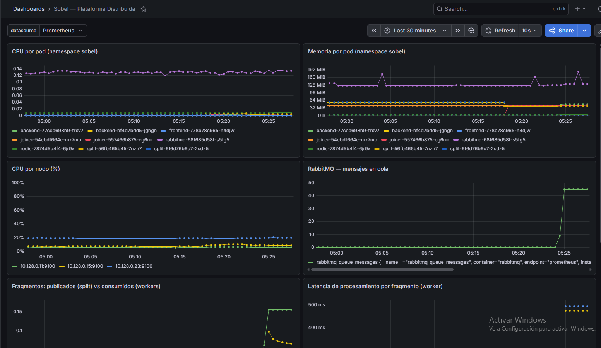

# Hit #4 — Observabilidad (Prometheus + Grafana)

Stack de observabilidad sobre el cluster GKE del [Hit #3](../Hit3/README.md). Despliega Prometheus y Grafana en el `infra-pool`, instrumenta los servicios con métricas custom, y agrega un dashboard y reglas de alerta.

Hit #4 **reutiliza la infraestructura del Hit #3** (cluster GKE, node pools, servicios). La instrumentación de código se hizo directamente en los servicios de `Hit3/services/`; esta carpeta contiene los artefactos nuevos de observabilidad.

---

## Arquitectura de observabilidad

```
                   ┌─────────────────── infra-pool ───────────────────┐
                   │                                                   │
   ServiceMonitor  │   ┌────────────┐      ┌──────────┐                │
  ┌────────────────┼──▶│ Prometheus │─────▶│ Grafana  │ NodePort 30300 │
  │                │   └─────┬──────┘      └──────────┘                │
  │                │         │             ┌──────────────┐            │
  │                │         └────────────▶│ Alertmanager │            │
  │                │   ┌──────────────┐    └──────────────┘            │
  │                │   │ node-exporter│ (DaemonSet en TODOS los nodos) │
  │                │   │ kube-state   │                                 │
  │                │   └──────────────┘                                 │
  │                └───────────────────────────────────────────────────┘
  │
  │  scrape /metrics
  ├──────────────┬──────────────┬──────────────┬─────────────────┐
  │              │              │              │                 │
┌─▼─────┐  ┌─────▼───┐  ┌───────▼──┐  ┌────────▼──┐   scrape estático
│Backend│  │  Split  │  │  Joiner  │  │ RabbitMQ  │   ┌────────────────┐
│ :8080 │  │  :9000  │  │  :9001   │  │  :15692   │   │  Worker VMs    │
└───────┘  └─────────┘  └──────────┘  └───────────┘   │  :8000/metrics │
   apps-pool (namespace sobel)         (plugin nativo) │  (fuera de GKE)│
                                                        └────────────────┘
```

- **In-cluster** (backend, split, joiner, rabbitmq): descubiertos vía **ServiceMonitor**.
- **Worker VMs** (fuera del cluster): scrape **estático** por IP interna (mismo VPC).
- **node-exporter**: DaemonSet en los 3 nodos → CPU/mem de cada nodo.
- **kube-state-metrics**: estado de pods/deployments.

---

## Componentes desplegados

| Componente | Ubicación | Acceso |
|---|---|---|
| Prometheus | infra-pool | interno (ClusterIP) |
| Grafana | infra-pool | NodePort `30300` |
| Alertmanager | infra-pool | interno |
| node-exporter | DaemonSet (todos los nodos) | — |
| kube-state-metrics | infra-pool | — |

Instalado con el Helm chart oficial `prometheus-community/kube-prometheus-stack`.

---

## Estructura

```
Hit4/
├── README.md
├── helm/
│   └── values.yaml            # Config de kube-prometheus-stack
├── k8s/
│   ├── servicemonitors.yaml   # Scrape de backend/split/joiner/rabbitmq
│   ├── grafana-dashboard.yaml # Dashboard (ConfigMap, lo levanta el sidecar)
│   └── alert-rules.yaml       # PrometheusRule con 3 alertas
└── scripts/
    └── install.sh             # Instalación completa automatizada
```

---

## Decisiones de despliegue

| Decisión | Motivo |
|---|---|
| `infra-pool` subido a `e2-standard-2` | El stack completo de Prometheus suma ~1.5 GB; en `e2-medium` (4 GB) con RabbitMQ + Redis ya corriendo había riesgo de OOM |
| Grafana como **NodePort**, no LoadBalancer | La cuota `IN_USE_ADDRESSES` de GCP ya estaba al límite (4); NodePort no consume IP externa |
| Storage **emptyDir** (sin PVC) para Prometheus/Alertmanager | Evita chocar contra la cuota `SSD_TOTAL_GB`; retención reducida a 24 h. Las métricas se pierden si el pod reinicia (aceptable para esta demo) |
| Worker VMs por **scrape estático** | Las VMs están fuera del cluster; al recrearse cambian de IP — hay que actualizar `helm/values.yaml` y `helm upgrade` |
| `serviceMonitorSelectorNilUsesHelmValues: false` | Permite que Prometheus descubra los ServiceMonitor propios, no solo los del release de Helm |

---

## Instrumentación — métricas custom

Cada servicio expone `/metrics` (librería `prometheus-client`). Código en `Hit3/services/`.

| Servicio | Métrica | Tipo | Qué mide |
|---|---|---|---|
| **worker** | `sobel_worker_fragments_processed_total{worker_id,status}` | Counter | Fragmentos procesados (success/failed) |
| **worker** | `sobel_worker_processing_seconds{worker_id}` | Histogram | Tiempo de procesamiento por fragmento |
| **worker** | `sobel_worker_errors_total{worker_id}` | Counter | Errores de procesamiento |
| **split** | `sobel_split_requests_total{status}` | Counter | Peticiones de split |
| **split** | `sobel_split_fragments_total` | Counter | Fragmentos publicados |
| **split** | `sobel_split_duration_seconds` | Histogram | Tiempo de dividir+publicar |
| **joiner** | `sobel_joiner_fragments_received_total` | Counter | Fragmentos recibidos del fanout |
| **joiner** | `sobel_joiner_jobs_completed_total` | Counter | Jobs reconstruidos |
| **joiner** | `sobel_joiner_reconstruction_seconds` | Histogram | Tiempo de reconstrucción |
| **backend** | `sobel_backend_jobs_submitted_total{status}` | Counter | Jobs recibidos (ok/error) |
| **backend** | `sobel_backend_process_duration_seconds` | Histogram | Duración de `/process` |

**Tareas en cola** se obtienen del plugin nativo `rabbitmq_prometheus` (`rabbitmq_queue_messages`), habilitado en `Hit3/k8s/rabbitmq.yaml`.

---

## Dashboard

Dashboard **"Sobel — Plataforma Distribuida"** (`k8s/grafana-dashboard.yaml`). El sidecar de Grafana lo carga automáticamente al detectar el ConfigMap con label `grafana_dashboard: "1"`.



| Panel | Fuente |
|---|---|
| CPU por pod (namespace sobel) | cAdvisor / kubelet |
| Memoria por pod | cAdvisor / kubelet |
| CPU por nodo (%) | node-exporter |
| RabbitMQ — mensajes en cola | `rabbitmq_prometheus` |
| Fragmentos: publicados vs consumidos | `sobel_split_fragments_total` vs `sobel_worker_fragments_processed_total` |
| Latencia de procesamiento p50/p95/p99 | `histogram_quantile()` sobre `sobel_worker_processing_seconds` |
| Tasa de errores | `sobel_worker_errors_total`, `sobel_backend_jobs_submitted_total{status="error"}` |
| Fragmentos procesados por worker | `sobel_worker_fragments_processed_total` |

---

## Alertas

`PrometheusRule` con 3 alertas (`k8s/alert-rules.yaml`):

| Alerta | Condición | Severidad |
|---|---|---|
| `ColaTareasAlta` | `rabbitmq_queue_messages{queue="tareas"} > 20` por 1 min | warning |
| `WorkerCaido` | `up{job="sobel-workers"} == 0` por 1 min | critical |
| `ErroresProcesamiento` | `rate(sobel_worker_errors_total[5m]) > 0.1` por 2 min | warning |

Visibles en Prometheus (pestaña Alerts) y Alertmanager.

---

## Instalación

```bash
# Prerrequisitos: cluster GKE del Hit #3 corriendo, kubectl y helm configurados
bash scripts/install.sh
```

O paso a paso:

```bash
# 1. Helm chart
helm repo add prometheus-community https://prometheus-community.github.io/helm-charts
helm repo update
kubectl create namespace monitoring
helm install kps prometheus-community/kube-prometheus-stack -n monitoring -f helm/values.yaml

# 2. Firewall para Grafana (NodePort)
gcloud compute firewall-rules create allow-grafana-nodeport \
  --network default --allow tcp:30300 --source-ranges 0.0.0.0/0 \
  --target-tags <node-tag>

# 3. ServiceMonitors, dashboard y alertas
kubectl apply -f k8s/servicemonitors.yaml
kubectl apply -f k8s/grafana-dashboard.yaml
kubectl apply -f k8s/alert-rules.yaml
```

### Acceso a Grafana

```
http://<IP-externa-de-cualquier-nodo>:30300
usuario: admin   contraseña: sobel-admin
```

La IP de los nodos:
```bash
gcloud compute instances list --filter="name~gke-sobel-cluster" \
  --format="table(name,networkInterfaces[0].accessConfigs[0].natIP)"
```

---

## Mantenimiento

**Si se recrean las worker VMs** (cambian de IP): actualizar la lista de targets en `helm/values.yaml` (`additionalScrapeConfigs`) y aplicar:

```bash
helm upgrade kps prometheus-community/kube-prometheus-stack -n monitoring -f helm/values.yaml
```

**Modificar el dashboard**: editar `k8s/grafana-dashboard.yaml` y `kubectl apply` — el sidecar recarga el cambio en ~1 min.
