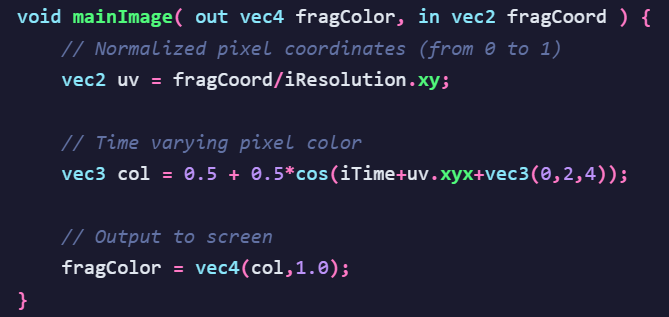

# Hit #1 — Pixel shaders y pipeline de renderizado

---

## Shader

Un shader es una operación programable que se aplica a los datos a medida que se mueven a través del pipeline de renderizado. Los shaders pueden actuar sobre datos como vértices y primitivas, generar o transformar geometrías y fragmentos, y calcular los valores en una imagen renderizada.  
Los shaders pueden ejecutar una amplia variedad de operaciones y estos se ejecutan en GPU, hardware dedicado que proporciona ejecución paralela de programas.

---

## Tipos de Shaders

• Fragment Shaders: Los fragment shaders, también conocidos como pixel shaders se ejecutan sobre cada fragmento o píxel generado durante el renderizado y determinan su color final y otros efectos visuales. Se utilizan para aplicar iluminación, sombras, transparencias, texturas y filtros 2D.  

• Vertex Shaders: Los sombreadores de vértices se ejecutan una vez por cada vértice 3D que se le pasa al procesador gráfico.  
El propósito es transformar la posición 3D de cada vértice en el espacio virtual a la coordenada 2D en la que aparece en la pantalla.  
Los sombreadores de vértices pueden manipular propiedades como la posición, el color y las coordenadas de textura, pero no pueden crear nuevos vértices.  
La salida del sombreador de vértices va a la siguiente etapa de la canalización.  

• Geometry Shaders: Este tipo de sombreador puede generar nuevas primitivas gráficas, como puntos, líneas y triángulos, a partir de las primitivas que se enviaron al inicio de la canalización grafica.  
Los programas de sombreado de geometría se ejecutan después de los sombreadores de vértices. Permiten modificar esas primitivas o incluso generar nuevas antes de que sean rasterizadas. Son útiles para crear geometría adicional de manera dinámica.  

• Tessellation shaders: Este shader añade dos nuevas etapas de sombreado al modelo tradicional: tessellation control shaders (también conocidos como sombreadores de envolvente) y tessellation evaluation shaders (también conocidos como sombreadores de dominio), que en conjunto permiten subdividir mallas más simples en mallas más finas en tiempo de ejecución según una función matemática.  

• Primitive and Mesh shaders: Son shaders más modernos que reemplazan parte de la canalización clásica de vértices y geometría. Permiten procesar grupos completos de primitivas o mallas con mayor eficiencia, ofreciendo más control y mejor rendimiento en escenas complejas.  

• Ray-tracing shaders: Se utilizan en técnicas de trazado de rayos, donde se simula el recorrido de la luz para calcular reflejos, refracciones, sombras e iluminación realista. Su objetivo es producir imágenes con un nivel visual mucho más cercano al comportamiento físico de la luz.

---

## Pipeline de renderizado

El pipeline de renderizado es la secuencia mediante la cual la GPU convierte datos geométricos en una imagen bidimensional visible. Durante este proceso intervienen principalmente el vertex shader en las etapas iniciales y el fragment shader en las finales.

### Procesamiento tridimensional (3D)

1. Ingreso de vértices y atributos: se cargan las posiciones y propiedades geométricas del objeto.  
2. Vertex Shader: cada vértice es transformado al espacio de visualización.  
3. Ensamblado de primitivas: los vértices forman puntos, líneas o triángulos.  

### Procesamiento bidimensional (2D)

4. Rasterización: las primitivas se convierten en fragmentos o posibles píxeles.  
5. Fragment Shader / Pixel Shader: se calcula el color y apariencia visual de cada fragmento.  
6. Escritura en framebuffer: se almacena la imagen final que será mostrada en pantalla.  

De esta manera, el pixel shader constituye una de las etapas más importantes del pipeline, ya que define la apariencia final de cada píxel renderizado.

---

## Video Post-Processing

El video post-processing consiste en aplicar filtros y efectos sobre la imagen ya renderizada para mejorar o modificar su aspecto visual, por ejemplo, mediante desenfoques, corrección de color, bloom o suavizado.  
Estas técnicas se ejecutan después de la etapa 6 del pipeline, cuando la imagen final ya se encuentra en el framebuffer. En esta instancia se realiza una nueva pasada de procesamiento 2D píxel por píxel, generalmente utilizando fragment shaders de pantalla completa.

---

## Entradas posibles en ShaderToy

ShaderToy provee un conjunto de variables uniformes predefinidas que funcionan como entradas del shader y permiten acceder a información del entorno, tiempo, interacción y recursos externos.

• Tipo: vec3  
Nombre: iResolution  
Descripción: contiene la resolución del viewport en píxeles. Sus componentes indican ancho, alto y proporción de píxel.  

• Tipo: float  
Nombre: iTime  
Descripción: almacena el tiempo de ejecución del shader en segundos desde su inicio. Se utiliza para animaciones.  

• Tipo: float  
Nombre: iTimeDelta  
Descripción: indica el tiempo transcurrido entre el frame actual y el anterior.  

• Tipo: float  
Nombre: iFrameRate  
Descripción: representa la cantidad de cuadros renderizados por segundo.  

• Tipo: int  
Nombre: iFrame  
Descripción: almacena el número de frame actual desde que comenzó la reproducción del shader.  

• Tipo: float[4]  
Nombre: iChannelTime  
Descripción: guarda el tiempo de reproducción correspondiente a cada uno de los cuatro canales de entrada.  

• Tipo: vec3[4]  
Nombre: iChannelResolution  
Descripción: contiene la resolución en píxeles de cada textura o canal conectado.  

• Tipo: vec4  
Nombre: iMouse  
Descripción: almacena información del mouse; xy representa la posición actual del cursor y zw la posición del último clic.  

• Tipo: sampler2D / samplerCube  
Nombre: iChannel0 a iChannel3  
Descripción: son los cuatro canales de entrada externos del shader. Pueden contener texturas, imágenes, audio, video, buffers o mapas cúbicos.  

• Tipo: vec4  
Nombre: iDate  
Descripción: contiene la fecha y hora actual en el formato año, mes, día y segundos transcurridos del día.  

• Tipo: float  
Nombre: iSampleRate  
Descripción: indica la frecuencia de muestreo de audio utilizada por el shader.

---

## Salidas posibles de los Pixel Shaders en ShaderToy

Según el howto de ShaderToy, los pixel shaders pueden generar tres tipos principales de salida: imagen 2D, sonido y realidad virtual. Cada una posee un punto de entrada y una salida específica.

### 1. Shader de Imagen

• Función: mainImage()  
• Salida: out vec4 fragColor  
• Tipo: vec4  

Descripción:  
Es la salida más común. fragColor representa el color final del píxel procesado y está compuesto por cuatro valores: rojo, verde, azul y alpha. Los tres primeros determinan el color visible, mientras que el cuarto corresponde a la transparencia.

### 2. Shader de Sonido

• Función: mainSound()  
• Salida: vec2  
• Tipo: vec2  

Descripción:  
En este caso el shader no devuelve una imagen sino una onda de audio. El vec2 representa la amplitud del sonido estéreo: un valor para el canal izquierdo y otro para el canal derecho.

### 3. Shader de Realidad Virtual (VR)

• Función: mainVR()  
• Salida: out vec4 fragColor  
• Tipo: vec4  

Descripción:  
Genera el color final del píxel para entornos de realidad virtual. Su salida funciona igual que en mainImage, pero teniendo en cuenta la dirección y origen del rayo visual dentro del espacio 3D virtual.

---

## Captura

---

## Análisis del shader “Hello World”

### ¿Qué representa uv?

uv representa la posición normalizada del píxel dentro de la pantalla. Se obtiene dividiendo la coordenada absoluta fragCoord por la resolución iResolution.xy, por lo que sus valores quedan entre 0 y 1 en ambos ejes.

### ¿Por qué es necesario trabajar en UV y no en XY?

Porque las coordenadas XY dependen del tamaño real de la ventana. Si se usaran directamente, el shader cambiaría según la resolución. En cambio, las coordenadas UV son relativas y normalizadas, lo que permite que el efecto visual sea el mismo en cualquier pantalla.

### ¿Cómo se logra que el resultado sea una animación si las entradas son estáticas?

La animación se produce por la variable iTime, que cambia constantemente con el tiempo en cada frame. Al participar dentro de la función cos, hace que los valores de color varíen continuamente aunque la posición del píxel sea siempre la misma.

### ¿Cómo es posible que col sea de tipo vec3 si está igualado a una operación aritmética entre flotantes?

Porque en GLSL las operaciones aritméticas están sobrecargadas para trabajar con vectores. La función cos(...) devuelve un vec3 y los escalares 0.5 se aplican automáticamente a cada componente. Por eso el resultado final también es un vector de tres componentes.

### ¿Cuáles son los constructores posibles para vec4?

GLSL permite construir un vec4 de varias maneras:  
• vec4(a,b,c,d)  
• vec4(vec3, d)  
• vec4(vec2, vec2)  
• vec4(vec2, a, b)  
• vec4(a): repite el mismo valor en las cuatro componentes  

Esto da flexibilidad para formar colores o vectores de posición.

### ¿Qué representan los componentes de fragColor?

fragColor es el color final que tendrá el píxel y es de tipo vec4 porque almacena:  
• componente 1: rojo (R)  
• componente 2: verde (G)  
• componente 3: azul (B)  
• componente 4: alpha o transparencia (A)

### uv se presenta como vec2 pero se utiliza su propiedad xyx, ¿qué es eso?

xyx es una técnica llamada swizzling. Permite tomar y reordenar componentes de un vector. En este caso, de uv = (x,y) se genera un vec3 formado como (x,y,x). Esto sirve para adaptar un vector de dos componentes a una operación que necesita tres.

### ¿Qué otras propiedades tiene vec2?

Un vec2 puede acceder a sus componentes como:  
• .x, .y  
• .r, .g  
• .s, .t  

y también puede combinarse:  
• .xy  
• .yx  
• .xx  
• .yy

### ¿Qué otras propiedades tiene vec3?

Un vec3 tiene:  
• .x, .y, .z  
• .r, .g, .b  
• .s, .t, .p  

y admite combinaciones como:  
• .xyz  
• .zyx  
• .rgb  
• .xxx

### ¿Qué otras propiedades tiene vec4?

Un vec4 tiene:  
• .x, .y, .z, .w  
• .r, .g, .b, .a  
• .s, .t, .p, .q  

y permite combinaciones como:  
• .xyzw  
• .rgba  
• .argb  
• .www

---