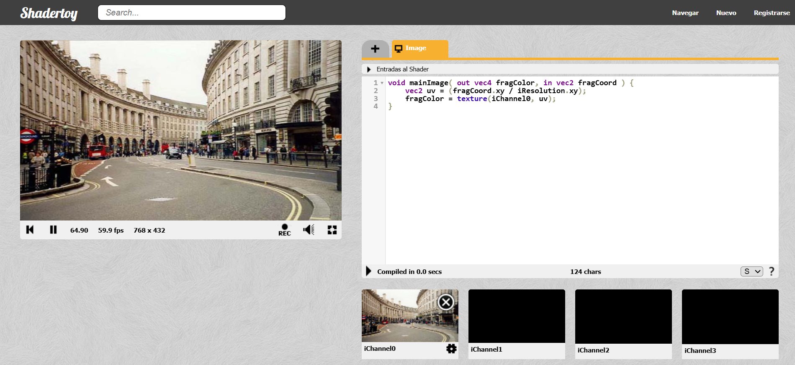

# Hit #3 — Primer muestreo de textura desde iChannel0

---

En este ejercicio se utilizó por primera vez una textura externa conectada en `iChannel0` dentro de ShaderToy. El objetivo fue realizar el caso más simple de muestreo: copiar directamente los píxeles de esa textura hacia la salida del shader sin aplicar modificaciones.

Este procedimiento permitió comprender cómo acceder a una imagen mediante coordenadas UV y constituyó la base para los efectos y filtros desarrollados en los hits posteriores.

## Captura

---