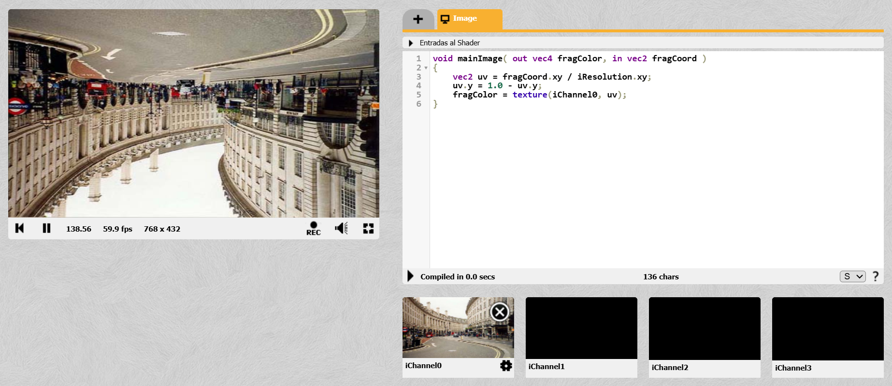
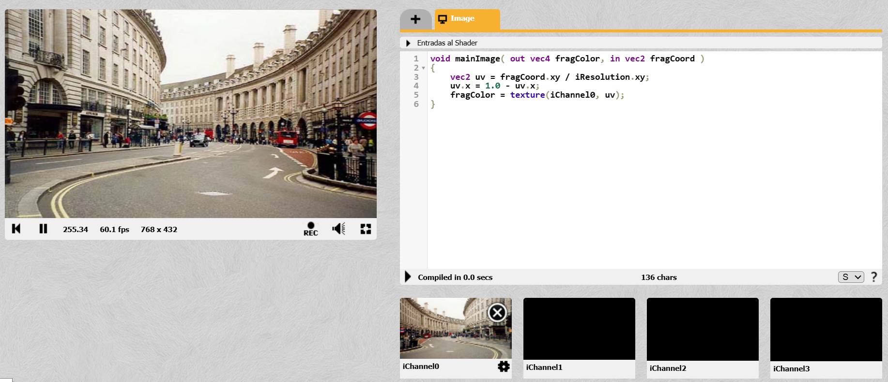
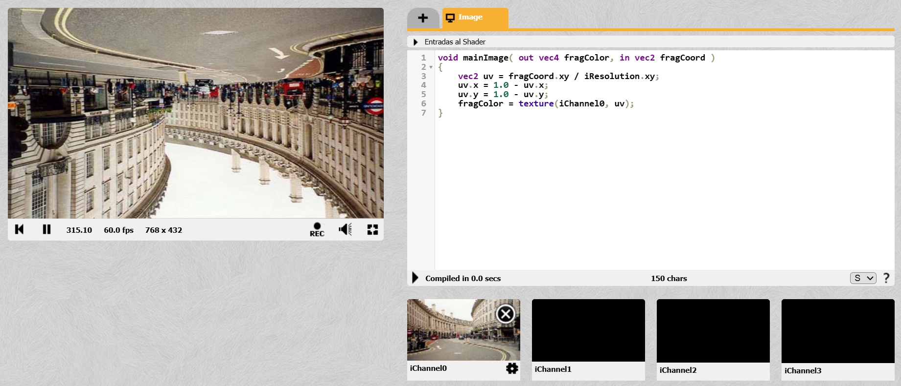

# Hit #4 — Transformaciones FLIP mediante coordenadas UV

---

En este ejercicio se tomó como base el shader que copia la textura de `iChannel0` y se modificó la forma de recorrer sus píxeles mediante las coordenadas UV. En lugar de leer la imagen de manera normal, se alteraron matemáticamente las componentes horizontal y vertical para invertir su orientación.

A partir de este procedimiento se implementaron tres variantes: FLIP-Y, FLIP-X y FLIP-X + FLIP-Y, comprobando que una simple modificación en las coordenadas de muestreo permite obtener distintos efectos de volteo sin alterar la textura original.

---

## Flip Y – Cabeza abajo

---

## Flip X – Espejo

---

## Ejemplo 3 — Flip X + Flip Y 

---