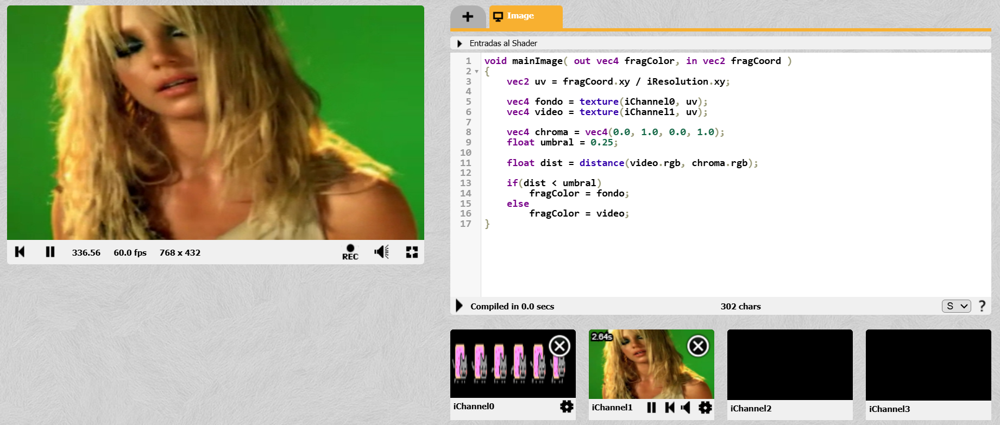
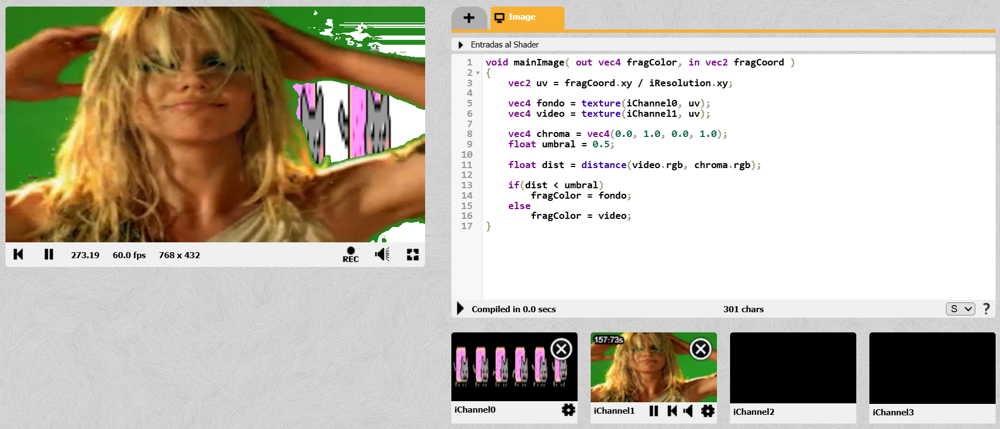
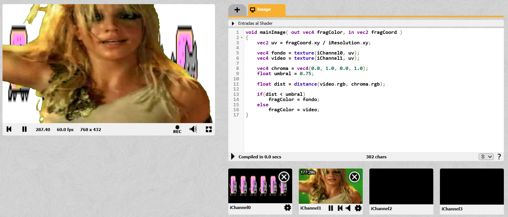

# Hit #5

---

En este ejercicio se utilizaron dos canales de entrada: `iChannel0` como fondo de reemplazo y `iChannel1` como video con pantalla verde. El objetivo fue desarrollar un filtro chroma básico capaz de detectar los píxeles verdes del video y sustituirlos por la imagen del otro canal.  

Para ello se definió un color verde de referencia y se calculó la distancia entre ese color y cada píxel del video dentro del espacio RGB. Luego, mediante un valor umbral, se determinó si el píxel pertenecía al fondo verde o al personaje. Si la distancia era pequeña, se mostraba `iChannel0`; si no, se conservaba `iChannel1`.  

De esta manera se logró una composición simple en tiempo real, aplicando operaciones matemáticas sobre el color de cada píxel.

---

## Color croma definido: 
vec4 chroma = vec4(0.0, 1.0, 0.0, 1.0);

---

## Primer umbral definido:
float umbral = 0.25;

---

## Cálculo de distancia entre el pixel del video y el verde:
float dist = distance(video.rgb, chroma.rgb);

---

## Condicion if:
if(dist < umbral)
    fragColor = fondo;
else
    fragColor = video;

---

## Prueba con umbral= 0.25:

---

## Prueba con umbral= 0.50:

---

## Prueba con umbral= 0.75:

---
