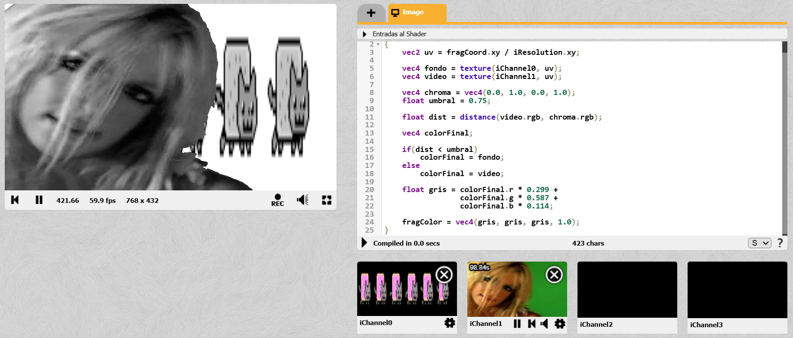

# Hit #6

---

Tomando como base el shader desarrollado en el Hit #5, se mantuvo el proceso de composición chroma entre `iChannel0` e `iChannel1`, pero se agregó una etapa posterior de postprocesamiento para transformar la imagen resultante a escala de grises.  

Una vez determinado qué píxel mostrar según la distancia al color verde, se calculó sobre ese color final un valor de luminancia perceptual, combinando ponderadamente sus componentes rojo, verde y azul. Dicho valor fue reutilizado en los tres canales de salida, obteniendo así una composición cromática en blanco y negro.  

De esta manera, el filtro no actúa sobre una textura aislada sino sobre el resultado completo del chroma key.

---

## Captura del resultado

---